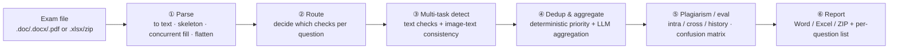

# Multilingual Exam Review Agent · exam_checker_agent

> 🌐 English ｜ [中文](README.md)

> A full-stack review platform that splits an entire exam paper into structured questions, runs per-question content / image-text / plagiarism checks, and produces reviewable reports.
> Feed it a `.doc/.docx/.pdf` paper or an `.xlsx/zip` evaluation set; through one pipeline — **parse → route → multi-task detect → dedup & aggregate → plagiarism / evaluation → report** — it produces a per-question issue list plus Word/Excel/ZIP reports.
>
> It runs as a single-process web platform: React frontend + FastAPI (with an in-process Flask bridge) backend + SQLite, started with one command.

---

> 📌 **About this repo**: a **desensitized design archive** of `exam_checker_agent` — Markdown notes and diagrams only, **no runnable source code, no company exam data, no verbatim prompts**. The goal is to record the architecture, prompt engineering, image-review pipeline and engineering trade-offs as a self-contained read for technical discussion and interviews. All prompt snippets are **rewritten skeletons** with generic examples — not the production originals.

## What problem it solves

Before delivery, exam papers need human review: typos, semantics, options, punctuation, whether figures match the text, whether questions collide with historical ones… It is high-volume, inconsistent across reviewers, and easy to miss. This platform turns review into a **pipelined, routable, reviewable, measurable** process: auto-split questions → decide per question what to check → run multiple detections concurrently → aggregate into a clean list → three kinds of plagiarism / evaluation → one-click report export. The hard, high-value part is **image-text consistency** — multimodal models often "describe the figure fluently yet miss the key anchor in it"; this project attacks that with a dedicated four-stage multimodal pipeline.

## Highlights

- 🧭 **Per-question routing of detections**: an LLM first decides which detection tasks each question needs (boolean switches; a missing key counts as false), skipping clearly inapplicable checks to cut wasted LLM calls. See [05](docs/05-路由与Agent还是工作流.en.md).
- 🖼️ **Four-stage multimodal image-text review + a text-only re-review safety net**: classify → formula OCR enriches the stem → single multi-image detection (forced "image observation checklist + claim reconciliation table") → **Step 4 text-only re-review targeting false negatives** (false→true flips only, to protect precision). This lifted image-text inconsistency **recall from a baseline of ≈10% (legacy recall≈0.264)** markedly. See [07](docs/07-图片审校深挖.en.md).
- 🧹 **Two-layer dedup & aggregation**: first a deterministic priority pass suppresses symptom errors at the same location by root cause (typo 90 > unsolvable 10), then an LLM aggregation layer does semantic merging, with **failures falling back without dropping errors**. See [08](docs/08-去重与聚合管线.en.md).
- 🌍 **20 detection tasks / 4 languages**: zh/ja/de/fr; one "typo" checkbox on the UI fans out to 4 language tasks; a unified error-type mapping decouples "display taxonomy" from "execution tasks". See [04](docs/04-错误类别与分类.en.md).
- 🔁 **Task-level resilience**: state-machine retry (optimistic locking) + heartbeat zombie recovery + per-question retry by execution issue (no full-batch rerun) + LLM timeout / degenerate-repetition handling. See [09](docs/09-重试与韧性.en.md).
- 📏 **A measurable evaluation loop**: xlsx/zip eval sets run a confusion matrix and output precision / recall / F1 / **F2 (recall-weighted)** / FPR, plus token accounting. See [10](docs/10-量化指标与评测.en.md).
- 🧩 **Dual web stack with an in-process bridge**: FastAPI for primary business + Flask for legacy detection, reused via an in-process WSGI call with zero network hop for a smooth migration. See [02](docs/02-系统架构.en.md).

## Documentation map

| # | Doc | Contents |
|---|---|---|
| 01 | [Background & Goals](docs/01-背景与目标.en.md) | Pain points, target users, final deliverables |
| 02 | [System Architecture](docs/02-系统架构.en.md) | Dual web stack in-process bridge, AppRuntime DI, tasks/TaskKind, SQLite migrations, client isolation |
| 03 | [End-to-End Flow](docs/03-端到端流程.en.md) | What happens at each node: five-stage parsing → routing → detection → plagiarism; the Excel eval line |
| 04 | [Error Categories](docs/04-错误类别与分类.en.md) | 20 detection tasks, unified type mapping, multilingual, severity/confidence |
| 05 | [Routing & "Agent or Workflow"](docs/05-路由与Agent还是工作流.en.md) | LLM decision points vs. deterministic pipeline — an honest take and an evolution path |
| 06 | [Prompt Engineering](docs/06-Prompt工程.en.md) | Detection prompt anatomy, fixed JSON schema, confidence threshold, few-shot recall, aggregation prompt |
| 07 | [Image Review Deep Dive](docs/07-图片审校深挖.en.md) | ★ Four-stage pipeline, prompt sections, Step 4 re-review, design tricks, quantified gains |
| 08 | [Dedup & Aggregation](docs/08-去重与聚合管线.en.md) | Three deterministic passes + an LLM aggregation layer, root-cause/symptom suppression |
| 09 | [Retry & Resilience](docs/09-重试与韧性.en.md) | Heartbeat/zombie recovery, state-machine retry, per-question retry, degenerate-repetition handling |
| 10 | [Metrics & Evaluation](docs/10-量化指标与评测.en.md) | Confusion matrix, P/R/F1/F2/FPR, token accounting, zip+xlsx eval bridging |
| 11 | [Tech Stack & Engineering Decisions](docs/11-技术栈与工程决策.en.md) | Tech stack, key trade-offs, robustness & security boundaries |

## Pipeline at a glance

## Tech stack

**Backend** Python 3.12 · FastAPI (business API) · Flask + Werkzeug (legacy detection API via in-process bridge) · Uvicorn · Pydantic 2 · SQLite · openai SDK (OpenAI-compatible / local vLLM) · langchain 0.3.x (parts of the detection chain) · python-docx / PyMuPDF / pdfplumber · openpyxl · Pillow · sentence-transformers (few-shot / plagiarism vectors) · thefuzz / python-Levenshtein / json-repair · langid

**Frontend** React 19 · TypeScript · Vite · Tailwind CSS

**Multimodal** OpenAI-compatible VLM (image classification / formula OCR / image-text consistency detection)

---

*A desensitized design archive, compiled by the author. Related: [mm_dataset_factory (multimodal data-generation platform)](https://github.com/CODE-BULIAO/mm-dataset-factory) · [EduFig-IC (image-text consistency benchmark)](https://github.com/CODE-BULIAO/edufig-ic).*
