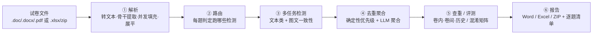

# 多语言试卷审校 Agent · exam_checker_agent

> [中文](README.md) ｜ 🌐 [English](README.en.md)

> 一个把「整份试卷」自动拆题、逐题检测内容/图文/查重问题、并产出可复核报告的**全栈审校平台**。
> 输入一份 `.doc/.docx/.pdf` 试卷或一个 `.xlsx/zip` 评测集，经「**文档解析 → 路由 → 多任务检测 → 去重聚合 → 查重 / 评测 → 报告**」一条流水线，产出逐题问题清单与 Word/Excel/ZIP 报告。
>
> 形态是单进程 Web 平台：React 前端 + FastAPI（进程内桥接 Flask）后端 + SQLite，一条命令启动。

---

> 📌 **关于本仓库**：这是 `exam_checker_agent` 项目的**脱敏设计归档**——只含 Markdown 说明与流程图，**不含可运行源码、公司题目数据或逐字 Prompt 原文**。目的是把这个项目的架构、Prompt 工程、图片审校链路与工程权衡完整记录成可独立阅读的资料，供技术交流与面试讲解使用。文中的 Prompt 片段均为**改写过的骨架**，配通用示例，不代表线上原文。

## 它解决什么问题

教研/出版的试卷在交付前要人工审校：错别字、语义、选项、标点、图文是否对得上、是否和历史题撞车……量大、口径不统一、易漏。本平台把这件事**流水线化、可路由、可复核、可量化**：自动拆题 → 按题判定该查什么 → 多类检测并发 → 去重聚合成干净清单 → 三类查重 / 评测 → 一键导出报告。其中**图文一致性检测**是难点也是重点——多模态模型常「看图说话很流畅，却对图中关键锚点视而不见」，本项目用一套四段式多模态链路专门攻这个问题。

## 核心亮点

- 🧭 **「按题路由」的检测调度**：每道题先由 LLM 判定需要跑哪些检测任务（输出布尔开关，缺键即视为 false），跳过明显不适用的检测，减少无效 LLM 调用。详见 [05](docs/05-路由与Agent还是工作流.md)。
- 🖼️ **四段式多模态图文审校 + 纯文本复审兜底**：分类 → 公式 OCR 增强题干 → 单次多图检测（强制「图像观察清单 + 题干断言对账表」）→ **Step4 纯文本复审专攻假阴性**（只允许 false→true 翻转，保护精确率）。该链路在 **mmdataset-v3 上召回率达 0.84（27B 本地）~0.88（plus 云端）、F1 0.89~0.92、FPR≈0.10**（弱实现版本召回仅约 0.26）。详见 [07](docs/07-图片审校深挖.md) 与 [10](docs/10-量化指标与评测.md)。
- 🧹 **双层去重聚合**：先「确定性优先级聚合」按同位置同根因抑制症状错误（错别字 90 > 题目无解 10），再「LLM 聚合层」做语义合并，且**失败回退不丢错**。详见 [08](docs/08-去重与聚合管线.md)。
- 🌍 **20 个检测任务 / 4 语言**：中/日/德/法，UI 上一个「错别字」勾选自动展开 4 语言任务；统一错误类型映射解耦「展示口径」与「执行任务」。详见 [04](docs/04-错误类别与分类.md)。
- 🔁 **任务级韧性**：状态机重试（乐观锁）+ 心跳僵尸回收 + execution-issue 单题重试（不必整批重跑）+ LLM 超时/退化重复治理。详见 [09](docs/09-重试与韧性.md)。
- 📏 **可量化评测闭环**：xlsx/zip 评测集跑混淆矩阵，输出 precision / recall / F1 / **F2（召回加权）** / FPR，并计量 token 用量。详见 [10](docs/10-量化指标与评测.md)。
- 🧩 **双 Web 栈进程内桥接**：FastAPI 主业务 + Flask 旧检测能力，通过 WSGI 进程内调用零网络跳跃复用，平滑迁移。详见 [02](docs/02-系统架构.md)。
- 🔬 **同集消融实验（可复现）**：在同一数据集、同一 Dify judge 口径下对比「极简 prompt / 单一强 prompt / 四段式全流程 × plus / 27b」6 种配置，得出「**模型能力定上限、Prompt 是精确率/召回率拨盘、流程脚手架对弱模型才显著**」的结论（含图表）。详见 [12](docs/12-消融实验-prompt与流程.md)。

## 文档导航

| # | 文档 | 内容 |
|---|---|---|
| 01 | [背景与目标](docs/01-背景与目标.md) | 痛点、目标用户、最终产物 |
| 02 | [系统架构](docs/02-系统架构.md) | 双 Web 栈进程内桥接、AppRuntime DI、任务/TaskKind、SQLite 迁移、客户端隔离 |
| 03 | [端到端流程](docs/03-端到端流程.md) | 文档进入后逐节点：解析五阶段 → 路由 → 检测 → 查重；Excel 评测主线 |
| 04 | [错误类别与分类](docs/04-错误类别与分类.md) | 20 检测任务、统一类型映射、多语言、严重度/置信度 |
| 05 | [路由与「Agent 还是工作流」](docs/05-路由与Agent还是工作流.md) | LLM 自主决策点 vs 确定性流水线，诚实剖析与演进路线 |
| 06 | [Prompt 工程](docs/06-Prompt工程.md) | 检测 Prompt 解剖、固定 JSON schema、置信度阈值、Few-shot 召回、聚合 Prompt |
| 07 | [图片审校深挖](docs/07-图片审校深挖.md) | ★ 四段式链路、各 Prompt 分段、Step4 复审、设计巧思、量化收益 |
| 08 | [去重与聚合管线](docs/08-去重与聚合管线.md) | 三段确定性聚合 + LLM 聚合层、根因/症状抑制 |
| 09 | [重试与韧性](docs/09-重试与韧性.md) | 心跳/僵尸回收、状态机重试、单题重试、退化重复治理 |
| 10 | [量化指标与评测](docs/10-量化指标与评测.md) | 混淆矩阵、P/R/F1/F2/FPR、token 计量、zip+xlsx 评测桥接 |
| 11 | [技术栈与工程决策](docs/11-技术栈与工程决策.md) | 技术栈、关键权衡、健壮性与安全边界 |
| 12 | [消融实验：Prompt vs 流程](docs/12-消融实验-prompt与流程.md) | ★ 同集 6 格消融（M1/M2/Full × plus/27b）、图表、模型/Prompt/流程各自贡献 |

## 流水线一览

## 技术栈

**后端** Python 3.12 · FastAPI（业务 API）· Flask + Werkzeug（进程内桥接的旧检测接口）· Uvicorn · Pydantic 2 · SQLite · openai SDK（OpenAI 兼容 / 本地 vLLM）· langchain 0.3.x（部分检测链）· python-docx / PyMuPDF / pdfplumber · openpyxl · Pillow · sentence-transformers（Few-shot/查重向量）· thefuzz / python-Levenshtein / json-repair · langid

**前端** React 19 · TypeScript · Vite · Tailwind CSS

**多模态** OpenAI 兼容 VLM（图片分类 / 公式 OCR / 图文一致性检测）

---

*本仓库为项目设计归档，内容脱敏，由作者独立整理。相关：[mm_dataset_factory（多模态造数平台）](https://github.com/CODE-BULIAO/mm-dataset-factory) · [EduFig-IC（图文一致性基准）](https://github.com/CODE-BULIAO/edufig-ic)。*
