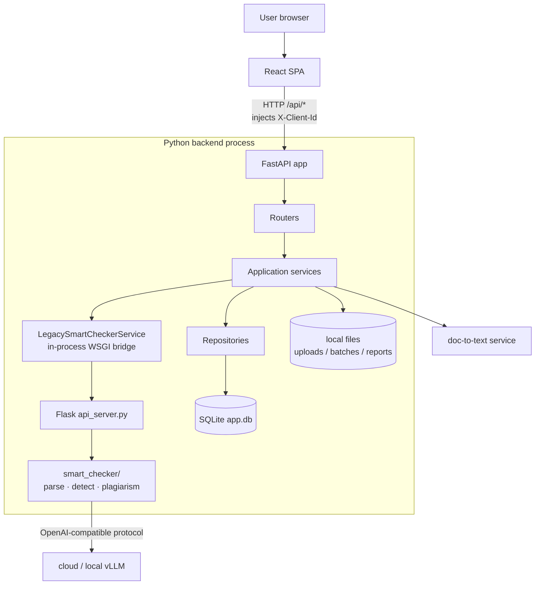
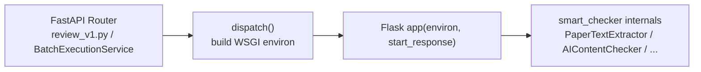

# 02 · System Architecture

> [Home](../README.en.md) ｜ [中文](02-系统架构.md) ｜ Prev: [01 Background & Goals](01-背景与目标.en.md)

## Overview

A single-process monolith: a React frontend (statically served by the backend after build) + a Python backend + SQLite + the local filesystem. Inside the backend is a **dual FastAPI + Flask stack**, talking to external LLM/VLM inference and a document-to-text service.

## Dual web stack: FastAPI + in-process Flask bridge

This is the design point interviewers probe most.

- **FastAPI** (primary): exposes `/api/*` business endpoints to the frontend (batches, tasks, findings, downloads, health, case library).
- **Flask** (legacy): holds the original detection/parse endpoints (`/api/v1/parse_paper`, `/api/v1/detect`, `/api/v1/duplicate/*`, …). **It does not listen on a socket.**
- **The bridge**: `LegacySmartCheckerService.dispatch()` builds a Werkzeug WSGI `environ` and **calls the Flask app in-process**, with no extra network hop.

**Why**: the legacy detection logic is large and battle-tested; a rewrite is risky. The in-process bridge reuses it **without rewriting**, while consolidating the external contract onto FastAPI (middleware, CORS, client-ownership checks, logging all live on the FastAPI side) for a smooth migration. The cost: "dual stack" is a transitional state, not the end goal — the evolution is to extract `smart_checker` into a standalone service and replace the in-process bridge with HTTP/gRPC.

> ⚠️ Gotchas: cross-cutting middleware only sits on the FastAPI side, so Flask routes don't get it automatically; `api_server.py` is also **imported as a module** to reuse its helper functions.

## AppRuntime: the dependency-injection root

`runtime.py` builds an `AppRuntime` container aggregating service instances: `store`, `archive`, `doc_convert`, `smart_checker`, `reporting`, `batch_execution`, `fewshot` (which may degrade to `None`), etc. Routers receive the runtime via a closure factory (`batches.create_router(runtime)`) rather than importing singletons inside function bodies — this lets tests inject doubles and avoids global state.

During construction it also performs two "self-healing" steps:
- `recover_interrupted_tasks()`: roll back tasks left in `running` after the process was killed.
- `recover_stale_running_tasks(timeout)`: reclaim zombie tasks by heartbeat timestamp (see [09](09-重试与韧性.en.md)).

## Tasks and TaskKind

Tasks split into two kinds by file extension (`domain/task_types.py`):

| TaskKind | Trigger | Default pipeline |
|---|---|---|
| `document_review` | Word / PDF / TXT / MD | `parse → review → internal_plag → cross_plag → history_plag` |
| `excel_evaluation` | .xlsx / .csv / .tsv | `parse → review → evaluate` |

The step list lives in `tasks.steps_json` and can be trimmed per task; transitions are driven by a state machine (optimistic-lock `version` column).

## Data layer & SQLite migrations

All table creation and **idempotent migrations** (`ALTER TABLE ... ADD COLUMN`) live in a single file, `core/database.py`. Main tables:

| Table | Role |
|---|---|
| `batches` | Batch metadata + `owner_id` ownership |
| `files` | Uploaded files (new/history, subject code) |
| `tasks` | Task status, current step, `retry_count`, `version`, `last_heartbeat_at` |
| `task_findings` | Detected issues + human review status/notes |
| `questions` | Parsed questions |
| `task_metrics` | Question count, per-stage latency, token usage, error message |
| `task_step_progress` | Step-level progress (frontend polling) |
| `batch_run_contexts` | Snapshot of batch launch params (restore config on restart/retry) |
| `fewshot_examples` | Dynamic few-shot cases + vector BLOB |

> Convention: when adding a column, change both `CREATE TABLE` and append an idempotent `ALTER`; read old DBs defensively with `row["col"] if "col" in row.keys() else default`.

## Client identity (ownership isolation, not auth)

The frontend generates a UUID in localStorage and sends it via the `X-Client-Id` header; the backend's `require_client_id` in `core/identity.py` reads it, batches are isolated by `owner_id`, and **cross-owner access returns 404** (not 403, to avoid information leakage). This is session-level isolation, not authentication — the header is forgeable, suitable for an internal tool.

## A small Uvicorn entrypoint trap

`run.py → uvicorn backend.main:app` — note it's `backend.main` (not `backend.app.main`). `backend/main.py` is a shim: it adds the workspace root to `sys.path`, `chdir`s into `backend/` (since many config paths are relative to `backend/`), and only then does `from backend.app.main import app`.

---

Next: [03 · End-to-End Flow](03-端到端流程.en.md)
