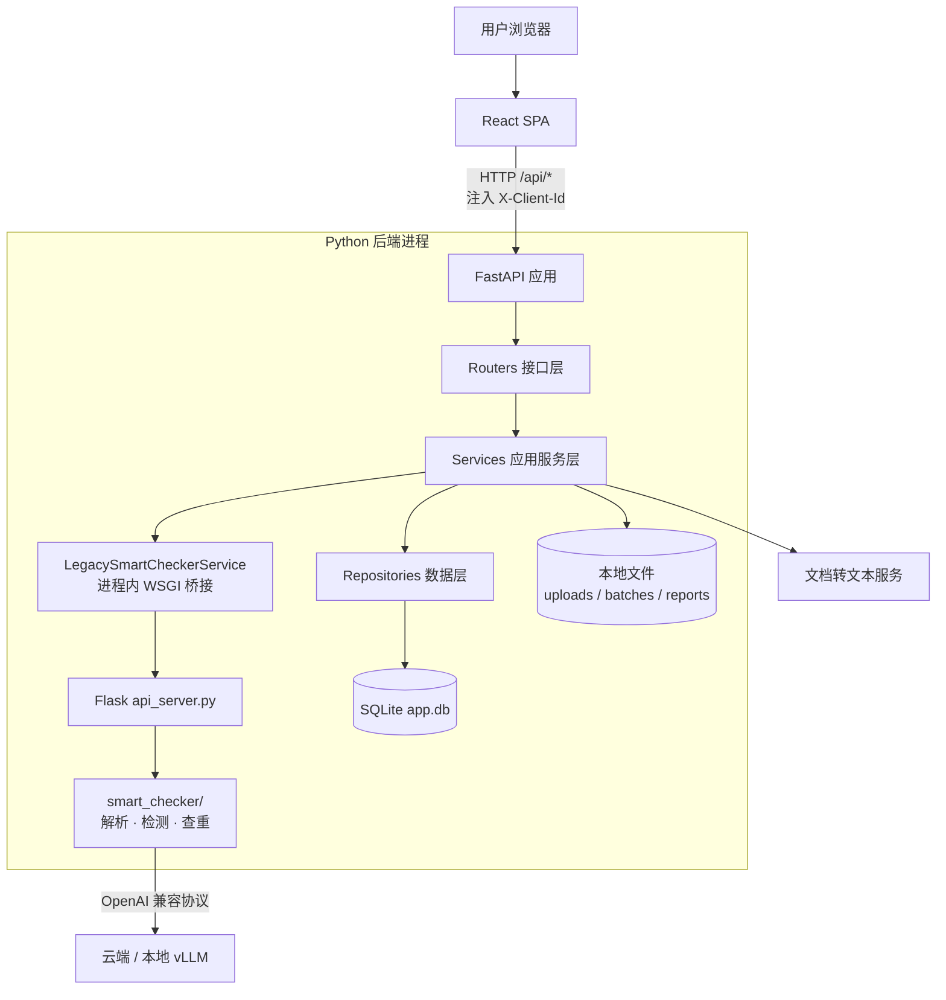
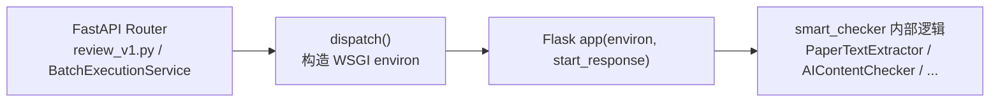

# 02 · 系统架构

> [返回首页](../README.md) ｜ 上一篇：[01 背景与目标](01-背景与目标.md)

## 总览

单进程单体应用：React 前端（构建后由后端静态托管）+ Python 后端 + SQLite + 本地文件系统。后端内部是 **FastAPI + Flask 双栈**，外接 LLM/VLM 推理服务与文档转文本服务。

## 双 Web 栈：FastAPI + 进程内 Flask 桥接

这是这套系统最容易被面试官追问的设计点。

- **FastAPI**（主）：对前端暴露 `/api/*` 业务接口（批次、任务、findings、下载、健康检查、案例库）。
- **Flask**（旧）：持有最初的检测/解析接口（`/api/v1/parse_paper`、`/api/v1/detect`、`/api/v1/duplicate/*` 等）。**它不监听 socket**。
- **桥接**：`LegacySmartCheckerService.dispatch()` 构造一个 Werkzeug WSGI `environ`，**直接在进程内调用 Flask 应用**，没有额外网络跳跃。

**为什么这么做**：旧检测逻辑庞大且经过验证，重写风险高。用进程内桥接，可以在**不重写旧逻辑**的前提下，把对外契约统一收口到 FastAPI（中间件、CORS、客户端归属校验、日志都挂在 FastAPI 侧），实现平滑迁移。代价是「双栈共存」是中间态而非终态——演进方向是把 `smart_checker` 抽成独立服务，用 HTTP/gRPC 替换进程内桥接。

> ⚠️ 易踩坑：跨切面中间件只挂在 FastAPI 侧，Flask 路由不会自动获得；`api_server.py` 同时被当作**模块导入**复用其辅助函数。

## AppRuntime：依赖注入根

`runtime.py` 构造一个 `AppRuntime` 容器，聚合 `store`、`archive`、`doc_convert`、`smart_checker`、`reporting`、`batch_execution`、`fewshot`（可降级为 `None`）等服务实例。Router 通过闭包工厂（`batches.create_router(runtime)`）接收 runtime，而不是在函数体里 import 单例——这让测试可以注入替身、避免全局状态。

构造期还会做两件「自愈」：
- `recover_interrupted_tasks()`：回滚进程被杀后残留在 running 的任务。
- `recover_stale_running_tasks(timeout)`：基于心跳时间戳回收假死任务（见 [09](09-重试与韧性.md)）。

## 任务与 TaskKind

任务按文件后缀分两类（`domain/task_types.py`）：

| TaskKind | 触发 | 默认流水线 |
|---|---|---|
| `document_review` | Word / PDF / TXT / MD | `parse → review → internal_plag → cross_plag → history_plag` |
| `excel_evaluation` | .xlsx / .csv / .tsv | `parse → review → evaluate` |

步骤列表存在 `tasks.steps_json`，可按任务裁剪；状态转换由状态机（乐观锁 `version` 列）驱动。

## 数据层与 SQLite 迁移

所有建表与**幂等迁移**（`ALTER TABLE ... ADD COLUMN`）集中在 `core/database.py` 一个文件。主要表：

| 表 | 作用 |
|---|---|
| `batches` | 批次元数据 + `owner_id` 归属 |
| `files` | 上传文件（新卷/历史卷、学科代码） |
| `tasks` | 任务状态、当前步骤、`retry_count`、`version`、`last_heartbeat_at` |
| `task_findings` | 检测问题项 + 人工复核状态/备注 |
| `questions` | 解析出的题目 |
| `task_metrics` | 题数、各阶段耗时、token 用量、错误信息 |
| `task_step_progress` | 步骤级进度（前端轮询） |
| `batch_run_contexts` | 批次启动参数快照（重启/重试时恢复配置） |
| `fewshot_examples` | 动态 Few-shot 案例 + 向量 BLOB |

> 约定：新增列时同时改 `CREATE TABLE` 与追加幂等 `ALTER`，读旧库用 `row["col"] if "col" in row.keys() else default` 防御式写法。

## 客户端身份（归属隔离，非鉴权）

前端在 localStorage 生成 UUID，通过 `X-Client-Id` 头随请求发送；后端 `core/identity.py` 的 `require_client_id` 读取，批次按 `owner_id` 隔离，**跨 owner 访问返回 404**（而非 403，避免信息泄露）。这是会话级隔离，不是认证——头字段可伪造，适合内部工具场景。

## Uvicorn 入口的小陷阱

`run.py → uvicorn backend.main:app`，注意是 `backend.main`（不是 `backend.app.main`）。`backend/main.py` 是一层 shim：把工作根目录加入 `sys.path`，并 `chdir` 到 `backend/`（因为很多配置路径相对 `backend/`），最后才 `from backend.app.main import app`。

---

下一篇：[03 · 端到端流程](03-端到端流程.md)
