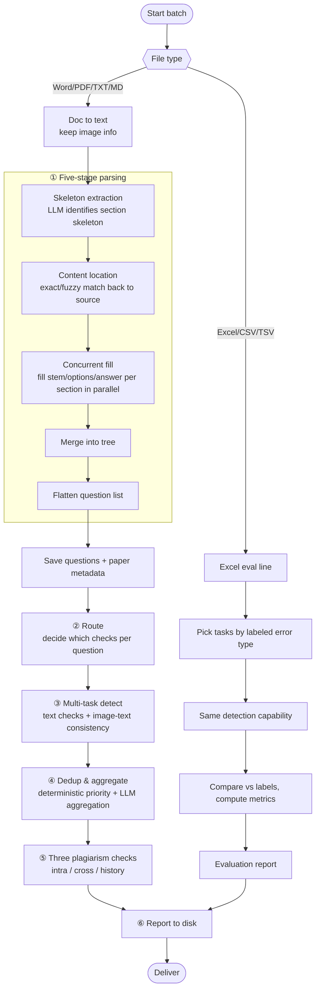

# 03 · End-to-End Flow

> [Home](../README.en.md) ｜ [中文](03-端到端流程.md) ｜ Prev: [02 System Architecture](02-系统架构.en.md)

This chapter answers: **a document comes in — what exactly happens at each node.**

## Panorama

## ① Five-stage parsing (parse)

The raw document is first converted to plain text + an image map (`doc_image_map`) by the doc-to-text service, then goes through five stages (`extractor/paper_parser.py`):

1. **Skeleton extraction**: the LLM identifies the section/block skeleton in one shot — **titles and hierarchy only, no content**. This is free LLM generation (high autonomy).
2. **Content location**: use section titles to locate the corresponding text spans back in the source, via exact + fuzzy matching over normalized text (unifying full/half-width, Chinese numerals/Roman numerals), avoiding mis-truncation by sub-question numbers. **Deterministic.**
3. **Concurrent fill**: hand multiple sections to the LLM **in parallel** to fill stem, options, answer, reference. Falls back to serial on failure.
4. **Merge into tree**: stitch section results back into the full paper structure.
5. **Flatten question list**: DFS the tree into a per-question list, keeping major/minor numbers, hierarchy paths, and reference-material inheritance. **Purely deterministic.**

> Design intent: split "understanding structure" (LLM's strength) from "precise location/flattening" (the program's strength) — leverage the LLM's semantics while letting deterministic logic guarantee numbering and location precision.

Output: the `questions` table + paper metadata (subject, header candidate, language).

## ② Routing (the precursor to review)

For each question, the LLM reads structured info (type, first 200 chars of the stem, whether it has options, subject, section title, reference) and outputs **a set of boolean switches** deciding which detections to run, plus skip reasons. **Any missing key is treated as false** (that detection is skipped).

Routing exists to cut wasted LLM calls; the principle is "better over-check than under-check" — when unsure, output true. Details and the "is this an agent" discussion are in [05](05-路由与Agent还是工作流.en.md).

## ③ Multi-task detection (review)

Per the routing result, run the selected detection tasks for each question. Key scheduling params (runtime options injected in `legacy_smart_checker.py`):

- `question_parallel_max_workers = review_concurrency`: **question-level concurrency**, with the degree equal to the thread count chosen in the frontend.
- `multi_task_max_workers = 1`: **disables "multiple detection tasks running concurrently within one question"** — the multiple detection prompts of one question run one at a time, not mixed.
- `review_group_by_task = True`: detection is organized **grouped by task**.

> Why disable per-question multi-task concurrency: to align with the frontend concurrency and reduce different prompts mixing in vLLM and fighting over KV cache. Grouping by task also helps vLLM prefix-cache hits (the same prompt prefix hits consecutively).
>
> Text-class prompt structure and output schema are in [06](06-Prompt工程.en.md); the image-text sub-chain (classify→OCR→detect→re-review) is in [07](07-图片审校深挖.en.md).

## ④ Dedup & aggregation

After a question is checked by multiple tasks, you get several possibly-overlapping reports. The aggregation pipeline tidies them into a clean list: first deterministic priority suppression (same location, same root cause — keep the high-priority one, drop symptoms), then optional LLM semantic merging. See [08](08-去重与聚合管线.en.md).

## ⑤ Three plagiarism checks (document line)

- **Intra-paper (internal_plag)**: similarity among questions within one paper.
- **Cross-paper (cross_plag)**: new papers of the same batch & subject code compared against each other (batched once per subject, results written back to related tasks).
- **History (history_plag)**: find historical papers by subject mapping, compare new questions against historical ones.

Plagiarism turns questions into vectors and computes similarity, with an optional LLM re-check — not naive string matching.

## Excel evaluation line (evaluate)

`.xlsx/.csv/.tsv` (or packed as zip + an image directory) is recognized as `excel_evaluation`:

1. **parse**: `ExcelQuestionParser` reads questions and **labeled error types** (including cross-row global renumbering of image placeholders, see [07](07-图片审校深挖.en.md)).
2. **review**: run only the detection tasks corresponding to the Excel `error_type`.
3. **evaluate**: `EvaluationService` compares labels vs predictions, computes confusion-matrix metrics, and produces an evaluation report. See [10](10-量化指标与评测.en.md).

## ⑥ Report

Re-layout the questions and issues from the database into a Word review report, Excel issue detail, detection-process detail, and a batch ZIP. On the detail page, humans can confirm/reject/resolve/annotate each issue and distill typical judgments into the case library (dynamic few-shot), which flows back into the prompt injection of later detections.

## A note on the flowchart's wording

The older business flowchart draws detection as "finish one error type per round before the next". The more accurate description in code is: `review_group_by_task=True` + `multi_task_max_workers=1` + question-level concurrency — **grouped by task, no per-question multi-task concurrency, questions run in parallel**. Treat "strictly global per-type batching" as an idealized scheduling illustration; the real concurrency semantics follow the params in ③ above.

---

Next: [04 · Error Categories](04-错误类别与分类.en.md)
