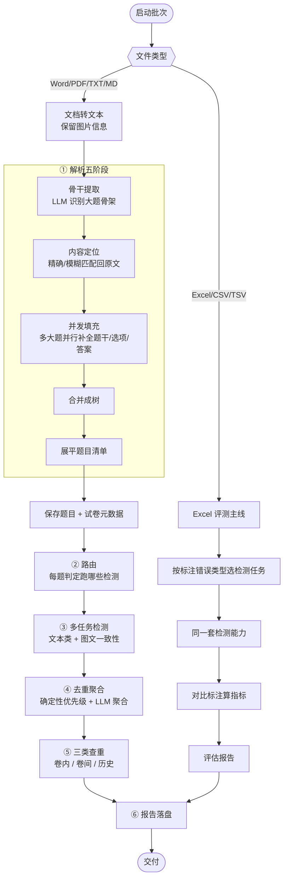

# 03 · 端到端流程

> [返回首页](../README.md) ｜ 🌐 [English](03-端到端流程.en.md) ｜ 上一篇：[02 系统架构](02-系统架构.md)

本篇回答：**一份文档进来，每个节点到底发生了什么。**

## 全景图

## ① 解析五阶段（parse）

输入原始文档，先经文档转文本服务转成纯文本 + 图片映射（`doc_image_map`），再走五阶段（`extractor/paper_parser.py`）：

1. **骨干提取**：LLM 一次性识别大题/版块骨架——**只要标题和层级，不填内容**。这是 LLM 自由生成（高自主度）。
2. **内容定位**：用大题标题回到原文定位对应文本片段，基于归一化文本（统一全/半角、中文数字/罗马数字）做精确 + 模糊匹配，避免子题编号误截断。这是**确定性**步骤。
3. **并发填充**：把多个大题**并行**交给 LLM，分别补全题干、选项、答案、参考材料。失败回退串行。
4. **合并成树**：把各大题结果拼回完整试卷结构。
5. **展平题目清单**：DFS 遍历树，生成逐题清单，保留大题号/小题号/层级路径/参考材料继承关系。**纯确定性**。

> 设计意图：把「理解结构」（LLM 擅长）和「精确定位/展平」（程序擅长）分开，既利用 LLM 的语义能力，又用确定性逻辑兜住编号与定位的精度。

输出：`questions` 表 + 试卷元数据（学科、卷头候选、语言）。

## ② 路由（review 的前置）

对每道题，LLM 读取结构化信息（题型、题干前 200 字、是否有选项、学科、大题标题、参考材料），输出**一组布尔开关**决定跑哪些检测，并给出跳过原因。**缺失的键一律按 false 处理**（对应检测被跳过）。

路由的目的是减少无效 LLM 调用，原则是「宁可多检测，不可漏检」——不确定时输出 true。细节与「这算不算 agent」的讨论见 [05](05-路由与Agent还是工作流.md)。

## ③ 多任务检测（review）

按路由结果，对每道题跑选中的检测任务。关键调度参数（`legacy_smart_checker.py` 注入的 runtime options）：

- `question_parallel_max_workers = review_concurrency`：**题目级并发**，并发数 = 前端选择的线程数。
- `multi_task_max_workers = 1`：**禁用「单题内多个检测任务并发」**——同一道题的多个检测 prompt 一个一个跑，不混跑。
- `review_group_by_task = True`：检测**按 task 分组**组织。

> 为什么禁单题多任务并发：和前端并发数对齐，并减少不同 prompt 在 vLLM 中混跑、相互挤占 KV cache。按 task 分组也有利于 vLLM 的 prefix cache 命中（相同 prompt 前缀连续命中）。
>
> 文本类检测的 Prompt 结构、输出 schema 见 [06](06-Prompt工程.md)；图文一致性这条子链（分类→OCR→检测→复审）见 [07](07-图片审校深挖.md)。

## ④ 去重聚合

一道题被多个任务检测后，会产生多条、可能重叠的报错。聚合管线把它们整理成一份干净清单：先确定性优先级抑制（同位置同根因，留高优先级删症状），再可选 LLM 语义合并。详见 [08](08-去重与聚合管线.md)。

## ⑤ 三类查重（文档主线）

- **卷内查重（internal_plag）**：同一份卷子内部题目相似度比较。
- **卷间查重（cross_plag）**：同批、同学科代码的新卷互相比对（每个学科批一次，结果回填相关任务）。
- **历史查重（history_plag）**：按学科映射找到历史卷，新题与历史题比对。

查重是把题目转成向量算相似度，必要时再用 LLM 复核，不是简单字面比对。

## Excel 评测主线（evaluate）

`.xlsx/.csv/.tsv`（或打包成 zip + 图片目录）被识别为 `excel_evaluation`：

1. **parse**：`ExcelQuestionParser` 读题目与**标注错误类型**（含跨行图片占位符全局重编号，见 [07](07-图片审校深挖.md)）。
2. **review**：按 Excel 里的 `error_type` 只跑对应检测任务。
3. **evaluate**：`EvaluationService` 对比标注与预测，算混淆矩阵指标，产出评估报告。详见 [10](10-量化指标与评测.md)。

## ⑥ 报告

把数据库里的题目与问题重新排版，产出 Word 审校报告、Excel 问题明细、检测过程明细、批次 ZIP。人工可在详情页对每条问题确认/驳回/解决/备注，并把典型判断沉淀进案例库（动态 Few-shot），回流到后续检测的 Prompt 注入。

## 关于流程图的一处口径说明

老的业务流程图把检测画成「按错误类型分轮跑完一类再下一类」。实际代码里更准确的描述是：`review_group_by_task=True` + `multi_task_max_workers=1` + 题目级并发——**按 task 分组、单题不并发多任务、题目之间并发**。把「全局严格按类型分批」当成理想化调度示意即可，真正的并发口径以上面 ③ 的参数为准。

---

下一篇：[04 · 错误类别与分类](04-错误类别与分类.md)
