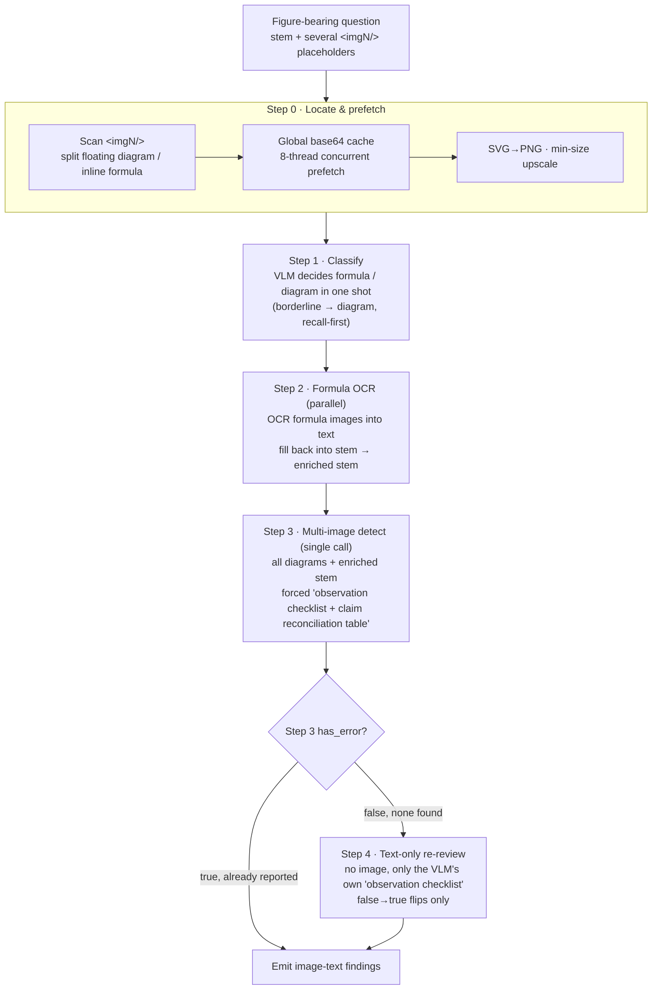

# 07 · Image Review Deep Dive ★

> [Home](../README.en.md) ｜ [中文](07-图片审校深挖.md) ｜ Prev: [06 Prompt Engineering](06-Prompt工程.en.md)

This is the hardest and most worthwhile part of the project: **image-text consistency detection**. A figure-bearing question whose stem says "the angle in the figure is 30°" while the figure shows 45°, or that pairs the wrong figure entirely — such errors are hard for humans to catch fully, and multimodal models are prone to "describing the figure fluently while being blind to the key anchor in it". This chapter covers how the four-stage pipeline is designed, how the prompts are sectioned, and the quantified gains.

> All prompt snippets are **rewritten skeletons + generic examples**, not production originals.

## Why "just throw the image at the VLM" fails

The naive approach is "image + stem → ask the VLM if they're consistent". Observed problems:

- The VLM's multimodal attention is easily pulled toward the figure's overall semantics, **missing a specific numeric/symbolic claim in the stem**;
- It tends to give "impressionistic" affirmations ("looks consistent"), lacking item-by-item checking;
- It excuses obvious conflicts with "a schematic may omit", "the student understands it", "doesn't affect solving".

This yields **low recall** (many false negatives). The whole pipeline is designed around "forcing the model to enumerate item by item, plus a re-review layer dedicated to false negatives".

## Four-stage pipeline overview



The pipeline is a composable chain: `step_classify | step_ocr | step_detect | step_review`, backed by two mixins (`ImageDetectionMixin` for Steps 0–3, `ImageReviewMixin` for Step 4).

## Step 0 · Locate & prefetch (where the engineering tricks cluster)

- **Split floating diagram vs inline formula**: a heuristic (HTML `position:absolute`, width threshold, etc.) routes them first. Inline formula images go to OCR, floating diagrams go to detection.
- **Global base64 cache**: within a batch the same image may be referenced by multiple questions. The prefetch stage grabs all images once with 8 threads and caches base64 by URL, **avoiding repeated downloads and repeated base64 encoding**.
- **SVG→PNG**: PyMuPDF rasterizes vector images (2x upscale) so the VLM can see them.
- **Min-size upscale**: some vision models require edge length > 10px; tiny images are upscaled via PIL bicubic to avoid the API's `invalid_parameter_error`.
- **Local path + HTTP both supported**: image sources can be HTTP(S) URLs or local absolute paths (the xlsx evaluation bridging case below).

## Step 1 · Classify (formula vs diagram)

The VLM splits all of a question's images into two classes in one shot:

- `formula`: inline formula/symbol images (narrow, ~one line tall, part of the stem text) → go to OCR.
- `diagram`: coordinate plots, circuits, geometry, chemical structures, charts, flowcharts (large, the core of solving) → enter image-text detection.

**A key trick — borderline images conservatively go to diagram:**

> If an image looks like a formula/symbol but carries reaction equations, chemical structures, curves, waveforms, circuits, geometric relations, parameter annotations, option figures, etc. — content **constrainable by the stem** — it must also go into `diagram_images` to avoid later misses. Only when it's certainly just plain inline typesetting symbols with no consistency-check value does it go to `formula` only.

`formula_images` and `diagram_images` **may overlap**. This "recall-first" fallback is crucial — without it, many "formula-looking" chemical structures/physics figures get one-shot classified as formula, dropped after OCR, and **never enter image-text detection**, becoming a major false-negative source.

## Step 2 · Formula OCR → enriched stem

Each formula image is sent to the VLM **in parallel** to be recognized into LaTeX/text and filled back into the stem placeholder, yielding an "enriched stem". For example:

```
Original: If <img1/> has the waveform shown in Figure 1 ...
Enriched: If [f(t)=A·sin(ωt+φ)] has the waveform shown in Figure 1 ...
```

Now in Step 3, the formula in the stem is text (a claim) rather than an image, and can be reconciled directly against the diagrams.

## Step 3 · Multi-image detection (single call + forced reconciliation)

All of the question's diagram images + the enriched stem go into **one** VLM call (not one call per image). The prompt is the core of the whole pipeline, forcing 4 steps that may not be skipped:

```
Step 1  Extract all "factual claims" the stem makes about the figures
        —— values/units/ranges/symbols/numbering/object names/connections/flow/polarity/support types…
        —— stress: trailing clarifying sentences in the stem (e.g. "the y-axis max scale in the figure is 5") are HARD constraints, never to be ignored as background

Step 2  Force-output an "image observation checklist" (with ==checklist== markers)
        —— list visible elements by category: values/topology/geometry/chemical structure/physical-model requisites/text labels/missing elements
        —— then a "per-image OCR/annotation transcription table": one row per image, transcribing formulas/numbers/superscripts/signs/arrows/chemical groups…
        —— conservatively mark confusable chars (±/+/-, ≤/</≥/>, μ/u, ω/w, 0/O, Cl/CI, OCH3/OH/CH3…); write "uncertain" if unreadable

Step 3  Auto-expand "model necessary conditions" by question type
        —— chemistry stereo: the carbon for R/S config must be an sp³ chiral carbon
        —— closed-loop control: the feedback path must exist and be closed, polarity consistent
        —— U-tube/connected vessels: the bottoms must actually connect
        —— transformer ratio ↔ line nominal voltage must match
        —— support types must not be downgraded (fixed hinge ≠ roller ≠ free end)… (dozens of subject rules)

Step 4  Output a "claim reconciliation table" and adjudicate
        —— one row per value/symbol/option parameter: stem value → actual transcription in figure → consistent? yes/no → if no, report position <imgN/>
        —— any "no" → has_error=true; multi-image questions must be adjudicated per image, not stop at the first error
```

### Why force "enumeration + a reconciliation table"

This is the core prompt idea of the whole pipeline: **force the model to enumerate facts one by one and reconcile them item by item, instead of giving an impressionistic conclusion**. Two sets of hard constraints stop the model from cutting corners:

- **Ban hallucinated affirmation**: ban inferring figure content from "the stem says X, so the figure should be X" (independent OCR required); ban writing "fully consistent" without evidence (must write "see the item-by-item reconciliation table").
- **Banned excuses**: once a fact in the figure is identified as inconsistent with the stem, it's banned to let it pass with any of "could be OCR noise", "a schematic needn't be precise", "the student understands it", "doesn't affect the final answer".

### Recall-first: wrong figure from another question

There's also a dedicated high-priority rule: if a placeholder sits in a clear semantic position ("the curve ``", "the equation ``", "A. ``") but the image's subject/discipline/role clearly doesn't belong to this question (the stem asks for a curve but a chemical reaction figure is given), it must be reported — because image-text review cares about "does this figure belong to this question", not "is this figure correct on its own".

## Step 4 · Text-only re-review (the recall safety net, the project's biggest highlight)

However strict Step 3 is, the VLM looking at the image can still miss a numeric claim in the stem. **Step 4 targets exactly such false negatives.**

The design philosophy (counterintuitive but effective):

- **Trigger condition**: only when Step 3 outputs `has_error=false`. Questions Step 3 already flagged are not re-reviewed — **to avoid Step 4 flipping true to false and hurting precision**.
- **Cannot see the image**: Step 4 is a **text-only LLM** receiving no images. It reads only the `==image observation checklist==` the VLM wrote in its `think` (the "second-hand facts" the VLM already saw and described) + the stem.
- **Only false→true flips**: re-review can only "rescue false negatives", **never true→false**. This is a hard guard on precision.
- **Same forced reconciliation**: extract the stem claims ∪ model necessary conditions and reconcile item by item against the checklist; the checklist **explicitly** conflicting with the stem → flip to report; the checklist **not mentioning** an item → don't report (one can't infer "the figure lacks it" from the VLM's silence).

**Why text-only is actually more accurate**: Step 4 isn't misled by the image itself; it coolly reconciles "the facts the VLM wrote down" against "the stem facts", with more focused attention, rescuing quite a few image-text inconsistencies Step 3 missed. This also explains why Step 3 must **force a structured "image observation checklist"** — it's not just reasoning trace for humans, it's the "evidence snapshot" input for Step 4. The two form a "detect by looking + re-check by description" double safety net.

### Flip hard gate (to stop Step 4 over-reporting)

- A flip is allowed only when the checklist **explicitly states the actual value/structure in the figure** and it directly conflicts with the stem;
- OCR/symbol differences require three conditions at once (the stem has the corresponding symbol, the checklist explicitly writes the figure's symbol, the difference is not a common OCR confusion) before flipping;
- Content the "student should draw themselves", a pure inline formula consistent with the stem, the question's own subject-reasoning errors — none of these flip.

### Observability

Step 4 accumulates stats: an `invocations / triggered / flipped / errors_added / by_skip_reason` histogram, logging one line per question (triggered or not, skip reason, flipped or not, how many added). This makes "how many false negatives the re-review rescued" measurable and tunable.

## Quantified gains (a real record)

The pipeline was iterated against a "weak implementation", leaving a clear before/after:

| Dimension | Weak impl (before) | Strong pipeline (after) |
|---|---|---|
| Detection steps | classify → ocr → detect (**no re-review**) | classify → ocr → detect → **review** |
| Main detection prompt | ~59 lines, a "common error examples" list, no forced structure | ~239 lines, **forced 4-step reconciliation** workflow |
| Classification rule | no "borderline → diagram" | yes (recall-first fallback) |
| Step 4 re-review | **none** | text-only re-review targeting false negatives |
| **Image-text inconsistency recall** | **≈10% (legacy recall ≈ 0.264)** | **markedly higher** (on the same dataset, findings went from 0~2 to hundreds) |

> Caveat on the numbers: these come from the project's internal pipeline-alignment record (same dataset `mmdataset_withtitle_correction.zip`, same model and params; the difference comes **only** from pipeline structure and prompt content). "Markedly higher" corresponds to the measured direction of "findings from single digits to hundreds, recall clearly above 0.264"; **fill in the precise after-recall from your latest evaluation report** (evaluation methodology in [10](10-量化指标与评测.en.md)).

**One-line interview version**: "I refactored image-text consistency detection from 'throw the image at the VLM once' into a **four-stage pipeline + a text-only re-review safety net**, and changed the main detection prompt from loose examples into **forced item-by-item reconciliation** (image observation checklist + claim reconciliation table). On the same dataset, same model and params, image-text inconsistency recall rose markedly from a baseline of ~10% (recall≈0.264), while 'the re-review only flips false→true' preserved precision."

## xlsx/zip evaluation image bridging (extra tricks)

Evaluation sets are often packed as `data.zip` (containing `dataset.xlsx` + an `images/` directory). Two error-prone points are handled specifically:

- **Placeholder normalization**: `<img_01> / <img01> / <img1>` are unified to `<imgN/>`, with stem placeholders and image_map keys normalized together.
- **Cross-row global renumbering**: per-row local `<img1/>` collide across multiple xlsx rows; parsing **renumbers globally** (row 2's `<img1/>` → `<img3/>`…), updating stem placeholders and image_map keys in sync, to avoid key collisions / misplaced images when aggregating into a single `doc_image_map`.
- **Direct local-path read**: image_map values are stored as HTML ``; the detection side uses a regex to distinguish local path vs HTTP, reading local files directly then base64, skipping HTTP.
- **Directory structure preserved**: extraction keeps the `images/` subdirectory, and batch cleanup treats it as an attached resource rather than mis-deleting it as an "unsupported format".

---

Next: [08 · Dedup & Aggregation](08-去重与聚合管线.en.md)
