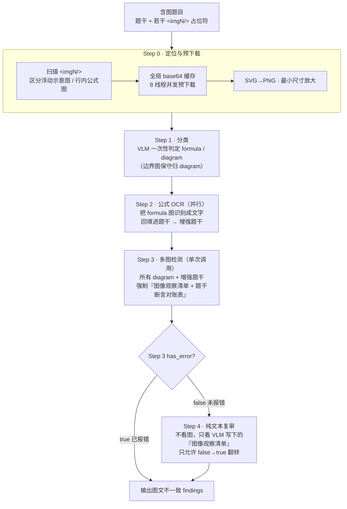

# 07 · 图片审校深挖 ★

> [返回首页](../README.md) ｜ 🌐 [English](07-图片审校深挖.en.md) ｜ 上一篇：[06 Prompt 工程](06-Prompt工程.md)

这是整个项目最难、也最值得讲的部分：**图文一致性检测（图文不一致）**。一道含图题，题干说「图中夹角 30°」而图里画 45°，或干脆配错了别题的图——这种错误人眼难查全，多模态模型又**容易「看图说话流畅、却漏掉关键锚点」**。本篇讲这条四段式链路怎么设计、Prompt 怎么分段、以及量化收益。

> 所有 Prompt 片段为**改写骨架 + 通用示例**，非线上原文。

## 为什么单靠「把图扔给 VLM」不行

最朴素的做法是「图 + 题干 → 问 VLM 一致吗」。实测问题：

- VLM 的多模态注意力容易被图的整体语义拽走，**漏掉题干里某一条具体数值/符号断言**；
- 倾向于给「印象式」的肯定结论（「看起来一致」），缺乏逐项核对；
- 会用「示意图可以省略」「学生自行理解」「不影响解题」之类借口放过明显冲突。

这导致**召回率很低**（漏报多）。本项目的整条链路就是围绕「逼模型逐项枚举、并补一层专攻漏报的复审」来设计的。

## 四段式链路总览



链路实现为一条可组合的 chain：`step_classify | step_ocr | step_detect | step_review`，对应两个 Mixin（`ImageDetectionMixin` 负责 Step0–3，`ImageReviewMixin` 负责 Step4）。

## Step 0 · 定位与预下载（工程巧思集中地）

- **区分浮动示意图 vs 行内公式图**：用启发式（HTML `position:absolute`、图片宽度阈值等）先分流。行内公式图走 OCR、浮动示意图走检测。
- **全局 base64 缓存**：一个批次里同一张图可能被多题引用。预下载阶段用 8 线程并发把所有图抓一次、按 URL 缓存 base64，**避免重复下载、避免重复 base64 编码**。
- **SVG→PNG**：用 PyMuPDF 把矢量图栅格化（2x 放大上采样），VLM 才能看。
- **最小尺寸放大**：部分视觉模型要求边长 > 10px，过小的图用 PIL 双三次插值放大，避免 API 报 `invalid_parameter_error`。
- **本地路径 + HTTP 双支持**：图片来源既可能是 HTTP(S) URL，也可能是本地绝对路径（xlsx 评测桥接场景，见下文）。

## Step 1 · 分类（formula vs diagram）

VLM 一次性把该题所有图分成两类：

- `formula`：行内公式/符号图（窄、约一行高，是题干文字的一部分）→ 去 OCR。
- `diagram`：坐标图、电路、几何、化学结构、统计图、流程图（大、是解题核心）→ 进图文检测。

**关键巧思——边界图保守归 diagram**：

> 若图片虽像公式/符号，但承载反应式、化学结构、曲线、波形、电路、几何关系、参数标注、选项图等**可被题干约束**的内容，也必须放进 `diagram_images`，避免后续漏检。只有确定只是普通行内排版符号、无任何图文核对价值时，才只归 `formula`。

`formula_images` 与 `diagram_images` **允许重叠**。这条「召回优先」的兜底规则非常重要——少了它，大量「看起来像公式」的化学结构/物理图会被一刀切归 formula，OCR 完就丢，**根本不进图文检测**，成为一大漏报源。

## Step 2 · 公式 OCR → 增强题干

把每张 formula 图**并行**送 VLM 识别成 LaTeX/文字，回填进题干对应占位符，得到「增强题干」。例如：

```
原始： 若 <img1/> 的波形如图1所示……
增强： 若 [f(t)=A·sin(ωt+φ)] 的波形如图1所示……
```

这样 Step 3 检测时，题干里的公式不再是「图」而是「文字断言」，可以直接和示意图对账。

## Step 3 · 多图检测（单次调用 + 强制对账）

把该题**所有 diagram 图 + 增强题干**放进**一次** VLM 调用（不是每图一调）。Prompt 是整条链路的核心，强制 4 步、不许跳：

```
第1步  抽取题干对图的所有「事实主张」
       —— 数值/单位/范围/符号/编号/对象名/连接关系/流向/极性/支座类型……
       —— 特别强调：题干末尾的追加描述句（如「图中纵轴最大刻度为5」）是【硬约束】，禁止当背景忽略

第2步  强制输出「图像观察清单」（带 ==图像观察清单== 标记块）
       —— 按 数值/拓扑/几何/化学结构/物理模型要件/文字标注/缺失要素 分类列出图中可见要素
       —— 再输出「逐图 OCR/标注转写表」：每张图单独一行，转写公式/数字/上下标/正负号/箭头/化学基团……
       —— 对易混字符保守标注（±/+/-、≤/</≥/>、μ/u、ω/w、0/O、Cl/CI、OCH3/OH/CH3……），看不清写「不确定」

第3步  按题型自动展开「模型必要条件」
       —— 化学立体题：R/S 构型对应碳必须 sp³ 手性碳
       —— 闭环控制：反馈回路必须存在且闭合、极性一致
       —— U形管/连通器：管底必须真实连通
       —— 变压器变比 ↔ 线路标称电压必须配套
       —— 支座类型不可降级（固定铰 ≠ 可动铰 ≠ 自由端）……（数十条学科规则）

第4步  输出「题干断言对账表」并裁决
       —— 每个数值/符号/选项参数独立一行：题干值 → 图中实际转写 → 一致？是/否 → 若否报错位置 <imgN/>
       —— 任一「否」→ has_error=true；多图题必须逐图裁决，不能发现一张错就停
```

### 为什么强制「枚举 + 对账表」

这是整条链路最关键的 Prompt 思想：**强迫模型把事实一条条枚举出来再逐项对账，而不是给一个印象式结论**。配套两组硬约束防止模型偷懒：

- **禁止幻觉式肯定**：禁止用「题干说 X，所以图中应为 X」反推图中内容（必须独立 OCR）；禁止写「完全一致」这种无证据总结（必须写「逐项对账见表」）。
- **禁用借口**：一旦从图中识别到与题干不符的事实，禁止用「可能是 OCR 噪声」「示意图不需精确」「学生自行理解」「不影响最终答案」等任一理由放过。

### 召回优先：错用别题图片

还有一条专门的高优先级规则：如果占位符处在明确语义位置（「曲线 ``」「方程 ``」「A. ``」），而图片的主题/学科对象/题型角色明显不属于当前题（题干要曲线却给化学反应图），必须报错——因为图文审校关注的是「这张图是不是属于这道题」，不是「这张图自己对不对」。

## Step 4 · 纯文本复审（兜底召回，本项目最大亮点）

Step 3 再严格，VLM 看图时仍可能漏掉题干里某条数值断言。**Step 4 专攻这种假阴性（漏报）。**

设计哲学（很反直觉、但很有效）：

- **触发条件**：仅当 Step 3 输出 `has_error=false` 时才触发。Step 3 已报错的题不复审——**避免 Step 4 把 true 翻成 false 影响精确率**。
- **看不到图**：Step 4 是**纯文本 LLM**，不接收任何图像。它只读 Step 3 在 `think` 里写下的那段 `==图像观察清单==`（VLM 已经看过图并描述完的「二手事实」）+ 题干。
- **只许 false→true 翻转**：复审只能「把漏报捞回来」，**绝不允许 true→false**。这是对精确率的硬保护。
- **同样强制对账**：抽取题干断言 ∪ 模型必要条件，与观察清单逐项比对；观察清单**明示**与题干冲突 → 翻转报错；观察清单**未提及** → 不报（不能由 VLM 的沉默推出「图中没有」）。

**为什么纯文本反而更准**：Step 4 不被图像本身误导，只对「VLM 自己写下的事实」和「题干事实」做冷静的文字对账，注意力更集中，能逮回不少 Step 3 漏掉的图文不一致。这一步也解释了 Step 3 为什么要**强制输出结构化的「图像观察清单」**——它不只是给人看的推理痕迹，更是 Step 4 的输入「证据快照」。两步形成「看图检测 + 看描述复核」的双保险。

### 翻转硬门槛（防止 Step 4 过报）

- 只有观察清单**明示了图中实际值/结构**且与题干直接冲突，才允许翻转；
- OCR/符号差异需同时满足三条（题干有对应符号、清单明确写出图中符号、差异非常见 OCR 混淆）才翻；
- 「学生应自行画出」的内容、纯行内公式且与题干一致、题目本身的学科推理错误——一律不翻。

### 可观测性

Step 4 累计统计：`invocations / triggered / flipped / errors_added / by_skip_reason` 直方图，每题打一行日志（触发与否、跳过原因、是否翻转、新增几条）。这让「复审到底捞回了多少漏报」可量化、可调参。

## 量化收益（真实记录）

这条链路是对照「弱实现」迭代出来的，留有明确的 before/after：

| 维度 | 弱实现（before） | 强链路（after） |
|---|---|---|
| 检测步数 | classify → ocr → detect（**无复审**） | classify → ocr → detect → **review** |
| 主检测 Prompt | 约 59 行的「常见错误示例列表」，无强制结构 | 约 239 行的**强制 4 步对账**工作流 |
| 分类规则 | 无「边界图归 diagram」 | 有（召回优先兜底） |
| Step4 复审 | **不存在** | 纯文本复审，专攻假阴性 |
| **图文不一致召回率** | 弱实现 recall ≈ 0.26 | **mmdataset-v3：0.836（27b）/ 0.878（plus）**，F1 0.89~0.92，FPR≈0.10 |

> 口径说明：弱实现 recall≈0.26 是早期内部快照（无 Step4 复审、弱 Prompt）；右列是四段式强链路在 **mmdataset-v3** 上的实测结果（完整跨模型对比表见 [10 · 量化指标与评测](10-量化指标与评测.md)）。两者数据集快照不同，不构成严格受控对比，但足以说明重构带来的量级提升。强链路的代价是 token 与延迟上升、Prompt 更长。（极简 prompt / 单一强 prompt / 四段式全流程 × plus / 27b 的**同集**消融对比见 [12 消融实验](12-消融实验-prompt与流程.md)。）

**一句话面试版**：「我把图文一致性检测从『一次性把图扔给 VLM』重构成**四段式链路 + 纯文本复审兜底**，并把主检测 Prompt 从松散示例改成**强制逐项对账**（图像观察清单 + 题干断言对账表）。在 mmdataset-v3 上，图文不一致召回率达 0.84（27B 本地）~0.88（plus 云端）、F1 0.89~0.92、精准 0.95+、FPR≈0.10，且通过『复审只许 false→true』保住了精确率（弱实现版本召回仅约 0.26）。」

## xlsx/zip 评测的图像桥接（巧思补充）

评测集常打包成 `data.zip`（含 `dataset.xlsx` + `images/` 目录）。这里有两个易错点被专门处理：

- **占位符归一化**：`<img_01> / <img01> / <img1>` 统一成 `<imgN/>`，题干占位符与 image_map 键同步归一。
- **跨行全局重编号**：多行 xlsx 每行的局部 `<img1/>` 会冲突，解析时**全局重编号**（第 2 行的 `<img1/>` → `<img3/>`……），题干占位符和 image_map 键同步更新，避免聚合到单一 `doc_image_map` 时键碰撞、图错位。
- **本地绝对路径直读**：image_map 值以 HTML `` 存储，检测端用正则区分本地路径 vs HTTP，本地直接读文件再 base64，省去 HTTP。
- **目录结构保留**：解压保留 `images/` 子目录，批次清理时把它当附属资源而非「不支持的格式」误删。

---

下一篇：[08 · 去重与聚合管线](08-去重与聚合管线.md)
