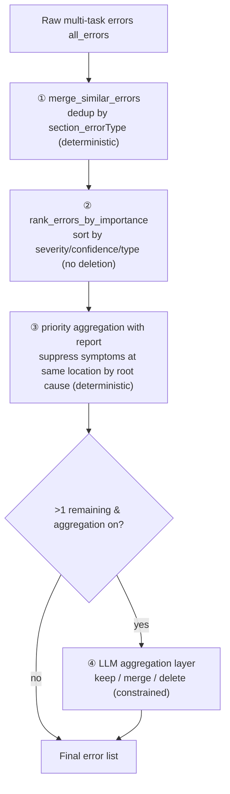

# 08 · Dedup & Aggregation

> [Home](../README.en.md) ｜ [中文](08-去重与聚合管线.md) ｜ Prev: [07 Image Review Deep Dive](07-图片审校深挖.en.md)

After a question is checked by multiple detection tasks, you get a pile of errors — often **the same spot reported several times from different angles** (e.g. a typo triggers both "typo" and "unsolvable"). The aggregation pipeline tidies them into a clean, non-duplicated, importance-ranked list.

## The four-pass pipeline

### ① merge_similar_errors (deterministic)

Merge errors with the **same location and same type** by `f"{section}_{error_type}"`. Note: different tasks have different `error_type`, so **cross-task it won't match here** — this pass only cleans duplicates within the same task.

### ② rank_errors_by_importance (deterministic, no deletion)

Sort by severity / confidence / type, putting the most critical first. **Sort only, no dedup.**

### ③ Priority aggregation + report (deterministic; heavy dedup happens here)

This is the real cross-type dedup layer. Core idea: **when a root-cause error exists, suppress the symptom errors derived from it.**

Type priority table (excerpt; higher = higher priority):

| Type | Priority |
|---|---:|
| Answer leakage | 95 |
| Typo | 90 |
| Option error | 85 |
| Image-text inconsistency | 80 |
| Missing info | 75 |
| Punctuation | 60 |
| Type mismatch | 55 |
| Logic error | 50 |
| Unclear semantics | 30 |
| Unsolvable | 10 |

Rules:

- **Same-location grouping**: offset diff ≤ 8 chars, or identical position text, or anchor_text/original_text overlap → same spot.
- **Droppable types**: `unsolvable` and `unclear semantics` are marked "suppressible at the same location". If a higher-priority root-cause error (e.g. "typo") already exists at the same spot, drop these symptoms.
  - Intuition: a question that "reads wrong → looks unsolvable" because of one typo should fix the typo; don't also report a separate "unsolvable".
- **Alias normalization**: `Japanese: punctuation error`, `German: punctuation error`, etc. all normalize to `punctuation`, handled consistently across languages.
- **Emit a report**: which were dropped, suppressed by whom — recorded in a report, **auditable**.
- **Conservative boundary**: when location matching is uncertain, return False and **hand the call to the LLM aggregation layer**, not a forced delete.

### ④ LLM aggregation layer (constrained, deliberately weakened)

If more than one remains after ③ and aggregation is on, hand them plus the stem to the LLM, which decides per error:

- `keep` as-is · `merge` and rewrite one unified description · `delete`
- **Hard constraints**: must not modify `error_type`; the action can only be one of these three.
- **Failures fall back without dropping errors**: on LLM error, or when returned ids can't be matched to original errors, **keep the originals** — never silently lose them.

> An important trade-off: **the LLM aggregation layer is deliberately weakened to "merge-first", leaving heavy dedup to the deterministic priority layer (③).** Why — the deterministic layer is reproducible, regression-testable and auditable; letting the LLM do heavy deletion is uncontrollable and prone to mis-deletion. This embodies the "use rules where you can" philosophy from [05](05-路由与Agent还是工作流.en.md).

## Why so many layers

| Layer | Nature | Problem solved |
|---|---|---|
| ① merge | Deterministic | Within-task same-location same-type duplicates |
| ② rank | Deterministic | Importance ranking (a stable order for humans and for ③) |
| ③ priority aggregation | Deterministic | Cross-type, same-location, root cause vs symptom |
| ④ LLM aggregation | LLM (constrained) | Cross-wording semantic merges rules can't cover |

Splitting "rules that can be fixed" from "merges needing judgment" keeps the main trunk reproducible and testable while retaining semantic flexibility for the long tail.

## Known risk (an honest note)

Silently dropping errors in the aggregation pipeline is a known risk — especially if the LLM aggregation layer's matching logic has a bug, it might merge away errors that should stay. The project guards this with a "fall back to keep the originals on failure" mechanism and writes deletions into the report for auditing; "aggregation drops errors" is a class of issue that has been specifically fixed historically, so prioritize the existing dedup-rule analysis and regression cases when changing aggregation behavior.

---

Next: [09 · Retry & Resilience](09-重试与韧性.en.md)
