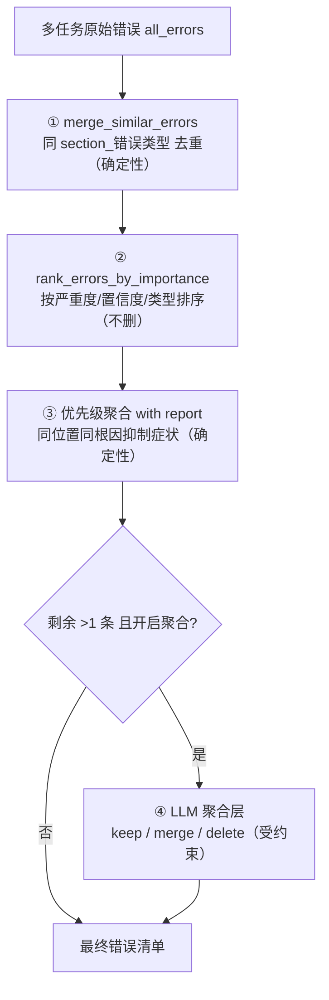

# 08 · 去重与聚合管线

> [返回首页](../README.md) ｜ 🌐 [English](08-去重与聚合管线.en.md) ｜ 上一篇：[07 图片审校深挖](07-图片审校深挖.md)

一道题被多个检测任务跑过后，会得到一堆错误，常常**同一处被多个任务从不同角度报了好几遍**（比如一个错别字同时触发了「错别字」和「题目无解」）。聚合管线负责把这堆错误整理成一份干净、不重复、按重要性排序的清单。

## 四段管线

### ① merge_similar_errors（确定性）

按 `f"{section}_{error_type}"` 把**同位置同类型**的错误合并。注意：不同 task 的 `error_type` 不同，所以**跨 task 不会在这一步命中**——这一步只清理同一任务内部的重复。

### ② rank_errors_by_importance（确定性，不删）

按 严重度 / 置信度 / 类型 排序，把最关键的排前面。**只排序、不去重**。

### ③ 优先级聚合 + 报告（确定性，重型去重在这里）

这是真正的跨类型去重层。核心思想：**有根因错误时，抑制由它派生的症状错误。**

类型优先级表（节选，数字越大越优先）：

| 类型 | 优先级 |
|---|---:|
| 答案泄露 | 95 |
| 错别字 | 90 |
| 选项错误 | 85 |
| 图文不一致 | 80 |
| 信息缺失 | 75 |
| 标点符号 | 60 |
| 题型不一致 | 55 |
| 逻辑错误 | 50 |
| 语义不清 | 30 |
| 题目无解 | 10 |

规则：

- **同位置分组**：偏移量差 ≤ 8 字、或位置文本相同、或 anchor_text/original_text 重叠 → 视为同一处。
- **可丢弃类型**：`题目无解`、`语义不清` 被标为「可在同位置被抑制」。同一处若已有更高优先级的根因错误（如「错别字」），就把这些症状删掉。
  - 直觉：一道题因为一个错别字导致「读不通 → 看起来无解」，那真正要修的是错别字，不该再单独报一条「题目无解」。
- **别名归一**：`日文：标点符号错误`、`德语：标点符号错误` 等都归一到 `标点符号`，跨语言一致处理。
- **出报告**：删了哪些、被谁抑制的，都记进 report，**可审计**。
- **保守边界**：位置匹配不确定时返回 False，把判断**让给 LLM 聚合层**，不强删。

### ④ LLM 聚合层（受约束，故意弱化）

如果③之后还剩多于一条，且开启了聚合，就把它们连同题干交给 LLM，逐条决定：

- `keep` 原样保留 · `merge` 合并并改写统一描述 · `delete` 删除
- **硬约束**：不得修改 `error_type`；动作只能是这三种。
- **失败回退不丢错**：LLM 出错、或返回的 id 无法和原错误匹配时，**保留原始错误**，绝不静默丢失。

> 一个重要的设计取舍：**LLM 聚合层被故意弱化为「以合并为主」，重型去重交给确定性优先级层（③）。** 原因——确定性层可复现、可写回归测试、可审计；让 LLM 做重型删除则不可控、容易误删。这正是 [05](05-路由与Agent还是工作流.md) 里「能用规则就用规则」哲学的体现。

## 为什么要分这么多层

| 层 | 性质 | 解决的问题 |
|---|---|---|
| ① merge | 确定性 | 任务内同位置同类型重复 |
| ② rank | 确定性 | 重要性排序（给人和给③一个稳定顺序） |
| ③ 优先级聚合 | 确定性 | 跨类型、同位置、根因 vs 症状 |
| ④ LLM 聚合 | LLM（受约束） | 规则覆盖不到的跨表述语义合并 |

把「能定死的规则」和「需要语义判断的合并」分开，既保证主干可复现可测，又保留对长尾情况的语义弹性。

## 已知风险（诚实记录）

聚合管线静默丢错误是已知风险点——尤其 LLM 聚合层若匹配逻辑出 bug，可能把该留的错误也合掉。项目里已为此做了「失败回退保留原错误」的兜底，并把删除写进报告以便审计；这类「聚合丢错」是历史上专门修过的一类问题，改聚合行为时要优先看现有的去重规则分析与回归用例。

---

下一篇：[09 · 重试与韧性](09-重试与韧性.md)
