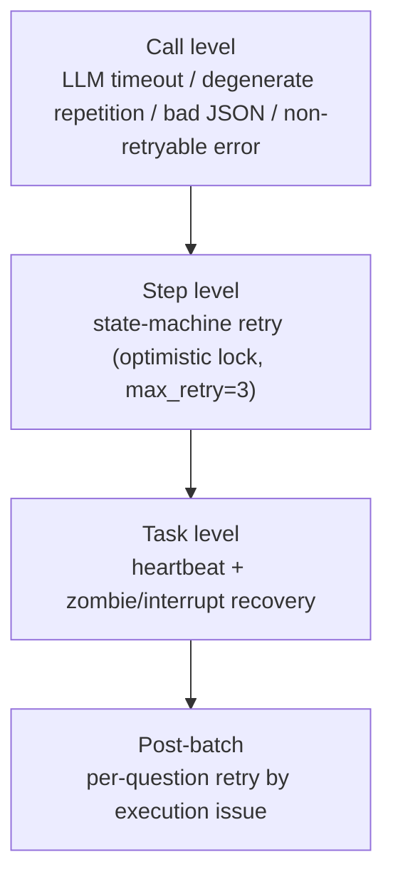

# 09 · Retry & Resilience

> [Home](../README.en.md) ｜ [中文](09-重试与韧性.md) ｜ Prev: [08 Dedup & Aggregation](08-去重与聚合管线.en.md)

A review batch easily spans dozens of papers, hundreds of LLM calls, tens of minutes. LLMs time out, degenerate, return bad JSON; processes get killed. This chapter covers how the system holds up at each level.

## Four levels of fault tolerance



## Call level

- **LLM timeout**: recognize "timed out / timeout / read timeout", raise `LLMServiceError`, propagate as a step failure.
- **Degenerate-repetition detection**: monitor streaming output for a "repeating token loop" (the model stuck repeating); on hit, raise `DegenerateRepetitionError`, handled as an LLM failure.
- **Bad-JSON repair**: use `json_repair` to auto-fix illegal JSON from the LLM (missing quotes, trailing commas), so one formatting glitch doesn't kill a whole step.
- **Fast-fail on non-retryable errors**: recognize **config-type errors** like `model_not_found / invalid api key / unauthorized / 401 / 403 / 404`, and **fail immediately, no retry** — retrying these ten thousand times won't help; fail early, report early.

## Step level: state-machine retry

The task state machine (optimistic-lock `version` column):

```
pending → running ⇄ retrying → success / failed / canceled
```

- Event-driven: `start / stepSucceeded / stepFailed / retry`.
- On `stepFailed`, `retry_count++`; if under `max_retry` (default 3) → go to `retrying` and rerun the current step; otherwise `failed`.
- Optimistic locking prevents races when concurrent workers grab the same task.

## Task level: heartbeat + zombie recovery

This is the classic problem of distributed/long tasks — **the process is killed, the task stays in running forever**. The handling:

- **Write heartbeats**: call `touch_task_heartbeat(task_id)` multiple times during execution to write `last_heartbeat_at`.
  - ⚠️ Engineering discipline: **if you add long-running new work inside a step (e.g. few-shot warmup loading sentence-transformers blocks 5–30s), you must manually write heartbeats before and after**, or the recovery thread will misjudge it as dead and kill it.
- **Recovery on startup** (during `runtime.py` construction):
  - `recover_interrupted_tasks()`: mark tasks left in pending/running/retrying after the process was killed as failed ("service stopped unexpectedly").
  - `recover_stale_running_tasks(timeout)`: by heartbeat timestamp, mark tasks whose `last_heartbeat_at` exceeds the threshold (default 120s, overridable via `TASK_HEARTBEAT_TIMEOUT_SECONDS`) as failed ("heartbeat timed out").

One handles "blanket cleanup on restart", the other "fine-grained judgment by heartbeat" — together ensuring no task is stuck forever.

## Post-batch: per-question retry by execution issue

In a long batch, often only **individual questions** had detection problems (one timed out, one failed JSON parsing, one had an aggregation drop). Rerunning the whole batch is too costly. So:

- **Failure attribution**: `execution_issues` tracks per-question, per-detection-task failure/degradation reasons during review, **distinguished by exception class** (timeout / JSON parse failure / skeleton failure / extraction failure / model error) rather than string sentinels — clear classification, statistics-friendly.
- **Build an issue list when the batch finishes**: scan failed items in the review debug artifacts, generate an `ExecutionIssue` list (scope, title, reason, question no., error type, retry count), stored in `tasks.execution_issue_summary`.
- **Per-question retry**: the user can "retry a single question by execution issue", rebuilding only that question's minimal context (stem, error types, options) and re-detecting, **reusing the same task and re-opening the review step without changing the batch status** — no full-batch rerun. Retry doesn't enable overall_check, to avoid duplication.

## Design trade-offs

- **Fast-fail vs retry**: config-type errors (auth / nonexistent model) fast-fail; only transient errors (timeout / formatting glitch) retry — spend the retry budget on failures that "might actually recover".
- **Push granularity down**: retry a single question rather than rerunning the whole batch — make the fault-tolerance granularity fine, saving time and tokens.
- **Observability first**: exception classification + issue list + heartbeat timestamps all exist so that "after a failure you can explain why, and retry precisely".

---

Next: [10 · Metrics & Evaluation](10-量化指标与评测.en.md)
