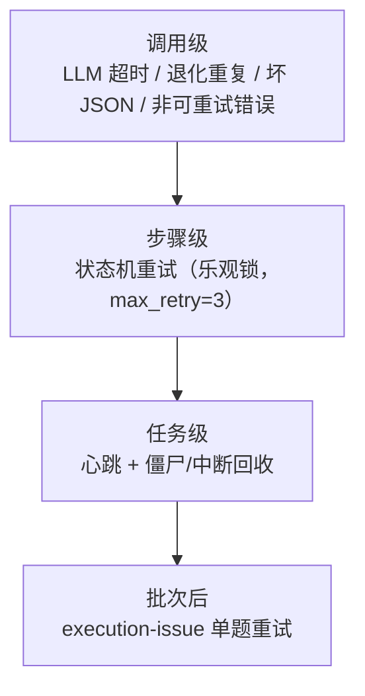

# 09 · 重试与韧性

> [返回首页](../README.md) ｜ 🌐 [English](09-重试与韧性.en.md) ｜ 上一篇：[08 去重与聚合管线](08-去重与聚合管线.md)

审校批次动辄几十份卷、上百次 LLM 调用、跑几十分钟。LLM 会超时、会退化、会返回坏 JSON，进程会被杀。这一篇讲系统在各个层级怎么扛。

## 四个层级的容错



## 调用级

- **LLM 超时**：识别 "timed out / timeout / read timeout" 等，抛 `LLMServiceError`，作为步骤失败上抛。
- **退化重复检测**：流式输出时监控是否陷入「重复 token 循环」（模型卡死复读），命中抛 `DegenerateRepetitionError`，按 LLM 失败处理。
- **坏 JSON 修复**：用 `json_repair` 自动修复 LLM 返回的非法 JSON（漏引号、多逗号等），尽量不让一次格式抖动毁掉整步。
- **非可重试错误快速失败**：识别 `model_not_found / invalid api key / unauthorized / 401 / 403 / 404` 这类**配置型错误**，**立即失败、不重试**——这些重试一万次也不会好，早失败早报错。

## 步骤级：状态机重试

任务状态机（乐观锁 `version` 列）：

```
pending → running ⇄ retrying → success / failed / canceled
```

- 事件驱动：`start / stepSucceeded / stepFailed / retry`。
- `stepFailed` 时 `retry_count++`；小于 `max_retry`（默认 3）→ 回到 `retrying` 重跑当前步骤；否则 `failed`。
- 乐观锁防止并发 worker 抢同一任务造成竞态。

## 任务级：心跳 + 僵尸回收

这是分布式/长任务系统的经典问题——**进程被杀，任务永远停在 running**。处理方式：

- **写心跳**：执行过程中多次 `touch_task_heartbeat(task_id)` 写 `last_heartbeat_at`。
  - ⚠️ 工程纪律：**在某步里加了长耗时新工作（如 Few-shot warmup 加载 sentence-transformers 阻塞 5–30s），必须手动在前后补写心跳**，否则会被回收线程误判为假死而杀掉。
- **启动时回收**（`runtime.py` 构造期）：
  - `recover_interrupted_tasks()`：把进程被杀后残留在 pending/running/retrying 的任务标记为 failed（「服务异常停止」）。
  - `recover_stale_running_tasks(timeout)`：基于心跳时间戳，把 `last_heartbeat_at` 超过阈值（默认 120s，可用 `TASK_HEARTBEAT_TIMEOUT_SECONDS` 覆盖）的任务标记为 failed（「心跳超时」）。

两者一个管「重启时一刀切」、一个管「心跳维度精细判定」，共同保证不会有任务永远卡死。

## 批次后：execution-issue 单题重试

一个长批次里，往往只是**个别题**的检测出了问题（某题 LLM 超时、某题 JSON 解析失败、某题聚合丢错）。整批重跑代价太大。所以：

- **失败归因**：`execution_issues` 在 review 阶段追踪每道题、每个检测任务的失败/降级原因，**用异常类区分**（超时 / JSON 解析失败 / 骨架失败 / 抽取失败 / 模型错误）而不是字符串哨兵——分类清晰、可统计。
- **批次跑完构建问题清单**：扫描 review 调试产物里的失败项，生成 `ExecutionIssue` 列表（scope、标题、原因、题号、错误类型、重试次数），存进 `tasks.execution_issue_summary`。
- **单题重试**：用户可「按 execution issue 单题重试」，只重建该题的最小上下文（题干、错误类型、选项）重新检测，**复用同一个 task、重新打开 review 步骤而不改批次状态**，不必整批重跑。重试时不开 overall_check 以避免重复。

## 设计取舍

- **快速失败 vs 重试**：配置型错误（鉴权/模型不存在）快速失败；瞬态错误（超时/格式抖动）才重试——把重试预算花在「可能真的会好」的失败上。
- **粒度下沉**：能单题重试就不整批重跑，把容错粒度做细，省时间省 token。
- **可观测优先**：异常分类 + 问题清单 + 心跳时间戳，都是为了「失败之后能讲清楚为什么、能精准重试」。

---

下一篇：[10 · 量化指标与评测](10-量化指标与评测.md)
