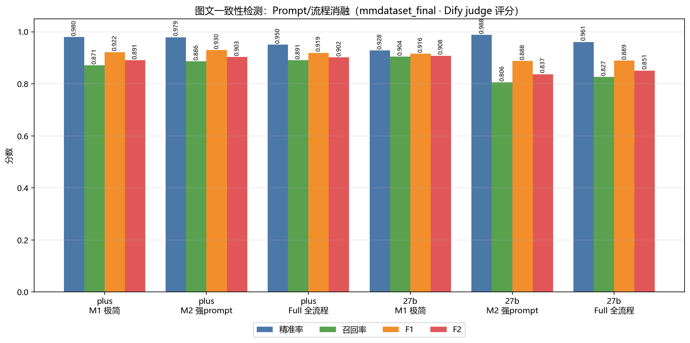
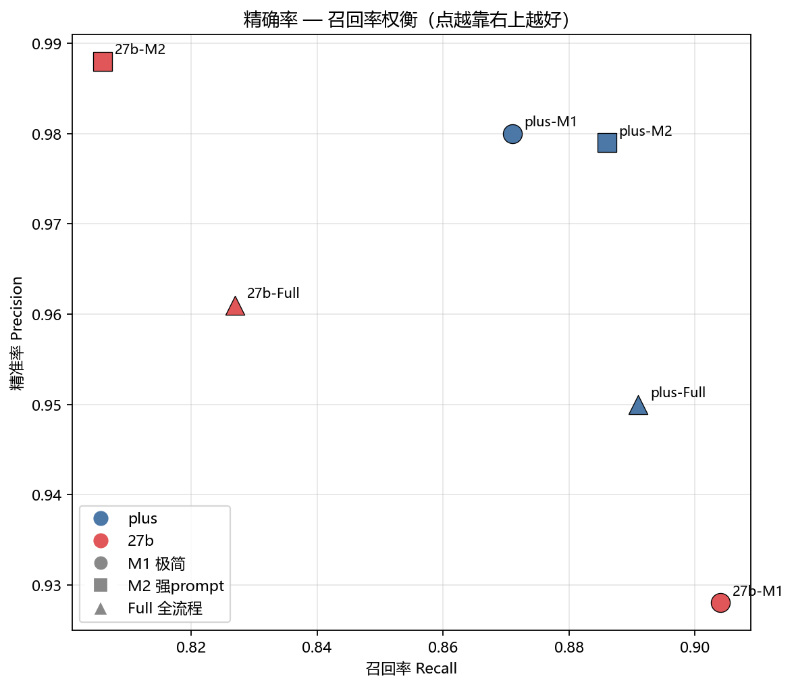

# 12 · 消融实验：Prompt 质量 vs 流程脚手架（图文一致性检测）

> [返回首页](../README.md) ｜ 上一篇：[11 技术栈与工程决策](11-技术栈与工程决策.md)

一个常被追问的问题：**图文一致性检测的效果，到底是「Prompt 写得好」带来的，还是「四段式流程脚手架」带来的？换更强的模型又能差多少？** 本篇用一组同数据集、同评分口径的消融实验回答。

## 实验设计

三种方法，逐级加料，**只改一个变量**：

| 方法 | 说明 | 调用形态 |
|---|---|---|
| **M1 · 极简 prompt** | 2–3 句话「这是试卷题，判断图文是否一致」 | 单次 VLM 调用，无分类/OCR/复审 |
| **M2 · 单一强 prompt** | 完整的「强制 4 步对账」检测 prompt（图像观察清单 + 题干断言对账表，见 [07](07-图片审校深挖.md)） | 单次 VLM 调用，无分类/OCR/复审 |
| **Full · 四段式全流程** | 分类 → 公式 OCR 增强 → 强 prompt 检测 → **Step4 纯文本复审** | 真实生产链路（每题多次调用） |

两个模型：**qwen3.6-plus**（云端旗舰多模态）、**qwen3.6-27b**（27B 开源权重多模态）。

- **数据集**：`mmdataset_final`，973 个图文样本（**669 正类**＝图文不一致 / **304 负类**＝原图一致）。
- **评分**：与生产完全一致的 **Dify LLM judge**（样本级宽松匹配），TP/TN/FN/FP 由 judge 判定。
- **控制变量**：Full 关闭路由（routing off），让每题都过四段式，从而 M2→Full 的唯一差异就是「分类+OCR+Step4 复审」这层脚手架；M1→M2 的唯一差异就是「prompt 质量」。
- temperature=0.7（与生产一致，含随机性，±0.5–1% 波动属正常）。

## 结果（同集 6 格矩阵）

| 数据集 | 模型名称 | 硬件 | 精准率 | 召回率 | F2 | F1 | FPR | 审校耗时(min) | TP | TN | FN | FP |
|---|---|---|---:|---:|---:|---:|---:|---:|---:|---:|---:|---:|
| mmdataset_final | qwen3.6-plus · M1 极简 | 新系统本地 | 0.980 | 0.871 | 0.891 | 0.922 | 0.053 | 12.8 | 630 | 230 | 93 | 13 |
| mmdataset_final | qwen3.6-plus · M2 强prompt | 新系统本地 | 0.979 | 0.886 | 0.903 | **0.930** | 0.062 | 49.3 | 644 | 211 | 83 | 14 |
| mmdataset_final | qwen3.6-plus · Full 全流程 | 新系统本地 | 0.950 | 0.891 | 0.902 | 0.919 | 0.125 | 64.6 | 627 | 230 | 77 | 33 |
| mmdataset_final | qwen3.6-27b · M1 极简 | 新系统本地 | 0.928 | **0.904** | 0.908 | 0.916 | 0.240 | 10.8 | 675 | 165 | 72 | 52 |
| mmdataset_final | qwen3.6-27b · M2 强prompt | 新系统本地 | **0.988** | 0.806 | 0.837 | 0.888 | **0.027** | 29.1 | 568 | 254 | 137 | 7 |
| mmdataset_final | qwen3.6-27b · Full 全流程 | 新系统本地 | 0.961 | 0.827 | 0.851 | 0.889 | 0.084 | 39.2 | 574 | 250 | 120 | 23 |

## 重点结论

**① 模型能力决定上限，比 prompt/流程更关键。**
plus 在**任意方法**下 F1 都在 0.919–0.930、F2 0.891–0.903；27b 最高 F1 0.916（还得靠高误报的 M1）。**plus 最差的 F1（0.919，Full）≈ 27b 最好的 F1（0.916，M1）**——也就是说，27b 不管怎么调 prompt/堆流程，都没追上 plus 用一句话极简 prompt 的水平。**选对模型 > 调 prompt > 堆流程。**

**② Prompt 是「精确率 ↔ 召回率」的拨盘，且对弱模型灵敏得多。**
27b 从 M1→M2，仅换 prompt：精准率 0.928→0.988、召回率 0.904→0.806、FPR 0.240→0.027——同一模型行为天差地别。plus 几乎不动（精准率 ~0.98、召回率 0.87–0.89）。**强模型对 prompt 鲁棒；弱模型高度依赖一个好 prompt 来收敛误报。**

**③ 四段式流程脚手架的价值，随模型强弱「反向」。**
- **27b（弱）受益**：Full 相比保守的 M2 把召回从 0.806 提到 0.827，同时 FPR 只有 0.084（远好于 M1 的 0.240）——是 27b 在「要召回又要少误报」时最均衡的配置。弱模型确实需要分类/OCR/Step4 复审来补召回、稳精度。
- **plus（强）几乎不受益甚至略伤**：Full 召回仅从 0.886 微升到 0.891，却把精准率从 0.98 拉到 0.95、FPR 从 0.05 抬到 0.125。**强模型一句话 prompt 已接近全流程**，Step4 反而引入更多误报。

**④ 读数必须连着看 FPR（评分用了宽松匹配）。**
Dify judge 采用**样本级宽松匹配**（命中同题另一处真实错误也算 TP），这会系统性**抬高「爱报错」模型的召回/F1**。最典型是 **27b-M1：F1 0.916 / F2 0.908 看似最高，但 FPR 高达 0.240**——每 4 张正常图就误报 1 张，生产不可用。所以 **F1/F2 不能单独看，必须和 FPR 一起读**；以「低误报 + 高召回」双约束衡量才公允。

**⑤ 按 F2（召回加权，审校首选指标）的推荐配置：**
- **plus**：M2（F2 0.903）或 Full（0.902）；要极低误报则 M1（FPR 0.053、F2 0.891）。综合性价比首选 **plus + M2 单一强 prompt**（F1 0.930 最高、成本只有 Full 的 ~0.75×）。
- **27b**：实用首选 **Full 全流程**（F2 0.851、FPR 0.084），在召回与误报间最平衡；M1 的 F2 虽高但 FPR 不可接受。

**⑥ 「plus 极简 prompt 竟然 > 27b 全流程」——同集验证：是真的。**
这个反直觉现象最初出现在跨数据集对比里（plus 在 `mmdataset_final`、27b 全流程在旧的 `mmdataset-v3`），有「快照伪差」嫌疑。本轮**全部在 `mmdataset_final` 同集**重测：plus-M1（F1 0.922）仍 > 27b-Full（F1 0.889），且 plus-Full（0.919）≈ plus-M1（0.922）。→ 这是**真实的模型能力差距**，不是数据问题；同集消除了快照伪差后，结论反而更硬。

**⑦ 成本。** 极简 M1 最快（plus 12.8min / 27b 10.8min）；全流程最慢（plus 64.6min / 27b 39.2min，多出分类+OCR+复审的多次调用）。在强模型上为「接近的指标」多花 ~5× 时间并不划算。

## 一句话总结

> 在图文一致性检测上，**模型能力是天花板，Prompt 是精确率/召回率的拨盘，四段式流程是给弱模型的「补召回 + 稳精度」脚手架**。强模型（plus）一句话 prompt 就接近全流程；弱模型（27b）才真正需要完整流程，且对 prompt 极其敏感。落地选型应「先选模型、再调 prompt、按需加流程」，并始终以 FPR 守门。

## 方法与口径 / 局限

- 检测：M1/M2 为单次 VLM 调用；Full 复用生产 `review_batch_with_debug` 真实四段式（routing 关闭以隔离「流程」单一变量）。评分：生产同款 Dify judge、同集、同口径。
- 局限：①judge 宽松匹配偏向高召回模型，需用 FPR 校正；②仅覆盖 2 模型 × 3 方法；③`mmdataset_final` 偏理工科含图题，结论对该域更可靠；④temp=0.7 存在随机性，小数点后第 3 位勿过度解读。
- 相关：检测链路细节见 [07 图片审校深挖](07-图片审校深挖.md)，评测口径见 [10 量化指标与评测](10-量化指标与评测.md)；数据集来自 [EduFig-IC](https://github.com/CODE-BULIAO/edufig-ic)。

---

[返回首页](../README.md)
