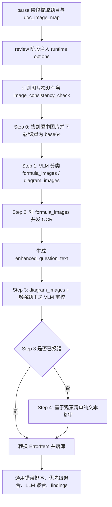

# 图文不一致算法逻辑说明

本文说明本项目中“图文不一致”的检测链路：它检测的是什么、输入如何结构化、何时区分公式图和示意图，以及最终如何完成审校与结果落库。

相关核心文件：

- 任务配置：`backend/config/domains/features.py`
- 文档/Excel 图片映射：`backend/app/integrations/doc_convert.py`、`backend/smart_checker/services/extractor/excel_parser.py`
- 批处理 parse/review 串联：`backend/app/services/batch_execution.py`、`backend/app/services/legacy_smart_checker.py`
- 图片检测主链路：`backend/smart_checker/services/detector/checkers/image_checker.py`
- 图片二次复审：`backend/smart_checker/services/detector/checkers/image_review.py`
- 分类 prompt：`backend/assets/prompt/detection/image_classify.txt`
- 审校 prompt：`backend/assets/prompt/detection/image_inconsistency.txt`
- 二次复审 prompt：`backend/assets/prompt/detection/image_inconsistency_review.txt`

## 1. “图文不一致”检测的本质

本项目里的“图文不一致”不是传统图像算法，例如模板匹配、目标检测、OCR 后规则比对，也不是只看 `<imgN/>` 占位符是否存在。它是一个以视觉语言模型（VLM）为核心的多阶段审校链路：

1. 从题目文本中找到图片占位符 `<imgN/>`。
2. 根据 `doc_image_map` 把占位符还原成真实图片。
3. 用视觉模型把图片分成“行内公式/符号图”和“题目示意图”。
4. 对公式图做 OCR，生成增强题干。
5. 把增强题干和示意图一起交给 VLM，执行图文对账。
6. 当 VLM 第一轮判定无错时，再用纯文本 LLM 基于第一轮输出的“图像观察清单”做一次反向复核，只允许把 false 翻成 true。
7. 把输出错误转成统一的 `ErrorItem`，进入项目通用的错误排序、优先级聚合、LLM 聚合和 findings 落库流程。

因此，它的算法逻辑可以概括为：

> 先建立“题干文字事实”和“图片可见事实”的结构化对账表，再判断二者是否冲突。

它关注的是“这张图是否属于当前题干、是否满足题干断言和题型必要结构”，而不是单独评价图片本身是否漂亮、清晰、学科上高级或答案是否唯一。

## 2. 入口与任务配置

图文不一致是一个中文检测任务：

```python
{
    "task_id": "image_consistency_check",
    "error_type": "图文不一致",
    "prompt_file": "detection/image_inconsistency.txt",
    "extra": {"is_image_check": True, "language": "zh", "ui_group": "zh"},
}
```

关键点是 `extra.is_image_check = True`。`AIContentChecker` 在批量检测时会识别这个标记，把该任务交给 `ImageDetectionMixin._run_image_detection_task()`，而不是普通文本检测逻辑。

React 批处理链路中，前端选择“图文不一致”后，后端把它解析成统一错误类型，再筛选出 `image_consistency_check`。实际运行时，`BatchExecutionService._execute_review()` 会把 parse 阶段保存的 `doc_image_map` 和 `image_service_base_url` 传给 `LegacySmartCheckerService.review_batch_with_debug()`，再通过 runtime context 传入旧检测器。

## 3. 图片与题目的结构化方式

### 3.1 文档类文件

Word/PDF 等文档走 `DocumentConversionClient.extract_text_with_images()`：

- `plain_text`：转换后的题面文本，图片位置用 `<img0/>`、`<img1/>` 等占位符表示。
- `image_map`：占位符到图片 HTML 的映射，例如 `<img0/> -> `。
- `image_service_base_url`：图片下载服务地址，下游用 `base_url + src` 拼出完整图片 URL。

parse 阶段会把这些内容保存到 debug artifacts：

```json
{
  "parse": {
    "raw_qs": [],
    "doc_image_map": {
      "<img0/>": ""
    },
    "image_service_base_url": "http://..."
  }
}
```

review 阶段再把这两个字段注入 runtime options。图片检测器从 runtime options 中读取它们。

### 3.2 Excel 评估文件

Excel/CSV/TSV 评估链路支持 `generated_image_map` 一类的图像映射列。`ExcelQuestionParser` 会把单元格里的字典解析成：

```json
{
  "<img1/>": ""
}
```

这里有两个重要处理：

1. 相对路径会解析成真实存在的绝对路径。找不到文件的图片会跳过，避免把相对路径误当 URL。
2. 每行图片会做全局重编号。比如第 1 行的 `<img1/>`、第 2 行的 `<img1/>` 不会互相覆盖，而会变成全局唯一的 `<img1/>`、`<img2/>`、`<img3/>`。

这样 Excel 分支最终也会聚合出同一个 `doc_image_map`，复用文档审校链路。

## 4. 运行时总体流程



## 5. Step 0：图片定位与预处理

`_find_images_in_question()` 会在题目文本中用正则查找 ``，然后用 `image_map` 找到对应 HTML，再解析 `src`。

初步判断“是否像浮动示意图”的规则是：

1. HTML 中含 `position:absolute` 或 `position: absolute`，认为是浮动示意图。
2. 否则解析 `style="width:120px"` 或 `width="120"`，宽度大于等于 100px 时认为是大图/示意图。
3. 其余先按行内图处理。

这个判断只是粗定位，不是最终分类。后面仍会把全部图片交给 VLM 做语义分类。

图片读取支持两类来源：

- HTTP/HTTPS：走 `requests.get()` 下载。
- 本地绝对路径或 `file://`：直接读盘，主要服务 Excel 评估链路。

如果是 SVG，会先转换成 PNG；如果图片边长太小，会放大到视觉模型要求的最小尺寸。批处理模式下还会提前预下载整批图片到 `_global_image_b64_cache`，避免每题每任务重复下载。

## 6. 什么时候区分公式和图片

区分发生在图片检测任务内部的 Step 1，也就是已经进入 `image_consistency_check` 之后。

它不是在 parse 阶段永久决定，也不是只靠 HTML 样式决定。真实逻辑是：

1. Step 0 先收集题中所有 `<imgN/>` 对应图片。
2. Step 1 把所有图片和题干文本一次性发给 VLM。
3. VLM 根据 `image_classify.txt` 输出：

```json
{
  "formula_images": ["<img0/>"],
  "diagram_images": ["<img1/>"],
  "reason": "img0 为行内公式，img1 为波形坐标图"
}
```

分类标准如下：

- `formula_images`：数学公式、变量表达式、上下标、分数、根号、普通排版符号等，通常是题干文字的一部分。
- `diagram_images`：坐标系、函数图像、波形、电路、实验装置、几何图形、化学结构式、统计图表、流程图、工程系统图、选项图等，通常需要学生理解或分析。

特别重要的是，二者允许重叠。比如一张图片看起来像公式，但它承载的是反应式、结构式、曲线、波形、电路、几何关系、参数标注或选项图，这张图也必须进入 `diagram_images`，避免漏检。

项目采用召回优先策略：

- 分类失败时，默认全部图片都是示意图。
- 如果 VLM 把全部图片都判成 formula，导致 `diagram_images` 为空，也会兜底把全部图片送入图文审校。
- 未被分类结果覆盖的图片，会补进 `diagram_images`。

所以“公式”和“图片”的区分不是互斥开关，而是一个服务审校的角色标注：

- 公式图用于 OCR，补全题干语义。
- 示意图用于图文一致性审校。
- 可核对的公式/结构/选项图可以两边都进。

## 7. Step 2：公式 OCR 与增强题干

对 `formula_images`，系统会并发调用视觉模型做 OCR，得到 `placeholder -> 公式/文字` 的映射。

例如：

```json
{
  "<img1/>": "f(t)=A\\sin(\\omega t+\\varphi)"
}
```

然后 `_build_enhanced_question_text()` 会把题干里的公式占位符替换成方括号包裹的 OCR 文本：

```text
原题干：若 <img1/> 的波形如图所示
增强后：若 [f(t)=A\sin(\omega t+\varphi)] 的波形如图所示
```

这样做的目的不是把公式图也当作错误检查对象，而是让后续审校示意图时能理解完整题意。

## 8. Step 3：VLM 图文审校逻辑

Step 3 会把以下内容一次性发给视觉模型：

- `reference`：题型/参考材料，辅助理解，不作为报错对象。
- `detection_content`：经过公式 OCR 增强后的完整题干。
- `diagram_images`：需要审校的图片占位符列表。
- 多模态图片：每个 `diagram_images` 对应的实际图片 base64。

审校 prompt 要求模型执行四步对账。

### 8.1 抽取题干事实主张

模型先从题干中抽取所有对图片的明确主张：

- “图中 XX 为 YY”
- “图中包含 ZZ”
- “图中标注为 AA”
- 明确数值、单位、范围、符号、编号
- 对象名称、连接关系、方向、极性、支座类型
- 题干末尾追加的图中说明

这些都被视为硬约束。

### 8.2 列出图像观察清单

模型必须在 `think` 中输出带标记的“图像观察清单”：

```text
==图像观察清单==
- 数值/单位/标号：...
- 拓扑/连接：...
- 几何/形状：...
- 化学结构：...
- 物理模型要件：...
- 文字标注：...
- 缺失要素：...
==图像观察清单END==
```

还必须逐图输出 OCR/标注转写表，分别列出每个 `<imgN/>` 中可见的公式、数字、单位、上下标、箭头、化学基团、端口、节点、元件标签等。

这一步是后续 Step 4 复审的关键，因为二次复审不再看图片，只看第一轮 VLM 自己写下的观察事实。

### 8.3 展开题型必要条件

除了题干明说的事实，prompt 还要求模型按题型展开必要条件。例如：

- 电路/控制题：反馈路径、闭合回路、端口标签、极性是否成立。
- 力学/流体题：支座、连通关系、力作用点、流向、尺寸链是否成立。
- 化学结构题：官能团、取代基、反应条件、可逆/单向箭头、共轭性是否成立。
- 函数/信号题：公式类型、系数、指数、上下限、变量、波形宽度和平移是否一致。

如果这些模型成立所必需的结构在图中明显违反，即使题干没有逐字写出，也可以判为图文不一致。

### 8.4 题干断言对账表与裁决

模型必须在 `think` 的最终决策段输出“题干断言对账表”：

```text
==题干断言对账表==
- 断言1：题干说“...” → 图中实际转写：“...” → 一致？是/否 → ...
==题干断言对账表END==
```

裁决规则是：

- 任一题干断言或必要条件与图像观察事实不匹配，`has_error = true`。
- 全部匹配且无可疑点，`has_error = false`。
- 多图题必须逐图裁决，不能发现一张错图后跳过其他图。
- 每条错误的 `position` 必须指向具体图片占位符，例如 `<img2/>`；如果是选项图片，则写对应选项和占位符。

输出 JSON 中的错误类型必须统一为：

```json
{
  "type": "图文不一致",
  "severity": "high",
  "description": "...",
  "suggestions": ["..."],
  "position": "<img2/>"
}
```

## 9. Step 4：二次复审如何工作

`ImageReviewMixin` 是一层防漏报机制，只在 Step 3 判定 `has_error=false` 时触发。

它的输入不是图片，而是：

- 增强题干 `detection_content`
- 示意图占位符 `diagram_images`
- Step 3 的完整 `think`
- Step 3 的 `reason`
- 从 `think` 中抽取出的 `==图像观察清单==...==图像观察清单END==`

复审模型的任务是质疑第一轮“无错”的结论。它只允许做一种动作：

> 当 Step 3 的观察清单已经写明了某个图中事实，且该事实与题干断言或必要条件直接冲突时，把无错翻转为有错。

它不会：

- 看原图。
- 猜测观察清单中没有写的图像细节。
- 把 Step 3 已经报错的结果改成无错。
- 报告“图文不一致”以外的错误类型。

如果复审输出 `needs_flip=true` 且带有 errors，系统会把这些错误转成 `ErrorItem`，description 前加 `[REVIEW]`，source 标记为 `ai_detection:image_consistency_check:review`。

## 10. 结果如何进入通用审校体系

Step 3 和 Step 4 结束后，`_persist_image_chain_detection_record()` 会把最终结果写入 `error_detection_outputs` 调试/评估记录。

如果 Step 4 翻转成功，持久化时会把原 Step 3 的 `has_error=false` 覆盖成最终 `has_error=true`，并写入 `review_triggered`、`review_needs_flip`、`review_raw` 等辅助字段。这样 Excel 评估阶段读取检测输出时，不会只看到 Step 3 的旧结论。

返回给主审校流程的是 `ErrorItem` 列表。之后它和普通文本检测结果一样进入：

1. `ErrorProcessor.merge_similar_errors`
2. `ErrorProcessor.rank_errors_by_importance`
3. `apply_priority_aggregation_with_report`
4. 可选的 `_aggregate_errors_with_llm`
5. findings 保存与报告导出

“图文不一致”在统一错误类型配置中映射为 `image_consistency_check`，严重度配置为“严重”，优先级配置中权重较高。

## 11. 报错边界

### 必须报错

- 题干明确断言与图中实际数值、符号、对象、连接关系不一致。
- 题干末尾追加的图中说明与图不一致。
- 图片主题、学科对象或题型角色明显不是当前题干占位符需要的内容。
- 题型必要结构不成立，例如电路未闭合、反馈路径缺失、连通器不连通、化学结构关键官能团不符。
- 同名/近名对象的面积、规模、数量、范围与题干冲突。
- 选项图片与选项文字、题干断言或题型角色直接冲突。

### 不报错

- 题干完全未涉及该信息，且它也不是题型必要条件。
- 图片只是装饰或背景，题目不依赖图作答。
- 单纯图片清晰度问题。
- 题干要求学生“补充/画出/标明/设计/绘制”的内容，原图允许不预先给出。
- 只有 `<imgN/>` 占位符但没有足够语境说明图片应该是什么，不靠模型臆测错误。
- 图片只是行内公式或选项公式时，只核对它与题干/选项文字是否一致，不因它不是完整装置图而报缺图。
- 题目本身的答案争议、学科推理难度、反应机理是否高级，不单独作为图文不一致。

## 12. 与其他错误类型的边界

项目里很多普通文本 prompt 都明确保护图片占位符：

- 不因“看不到图片内容”报信息缺失。
- 不因题干/选项只有图片占位符报题目无解。
- 不因不同图片占位符看起来只是 `<img1/>`、`<img2/>` 就报选项重复。
- 不把图片是否清晰、图片内容是否匹配交给语义不清、题型不一致等任务。

这意味着图片相关问题被刻意收敛到 `image_consistency_check`：

- 文本任务把 `<imgN/>` 当作有效信息承载。
- 图片任务才真正读取图片内容。
- 通用聚合层再按错误类型优先级处理多任务输出。

这样的设计可以避免普通文本模型因为“看不到图片”而大量误报。

## 13. 一句话总结

本项目的图文不一致检测是“占位符图片映射 + VLM 图片分类 + 公式 OCR 增强题干 + 示意图逐项对账 + 无错结论二次复审”的链式审校算法。它在进入图片检测任务后才区分公式图和示意图；公式图主要用于补全题干，示意图用于图文一致性审校；最终判断依据是题干事实主张、题型必要条件与图片可见事实之间是否存在直接冲突。
